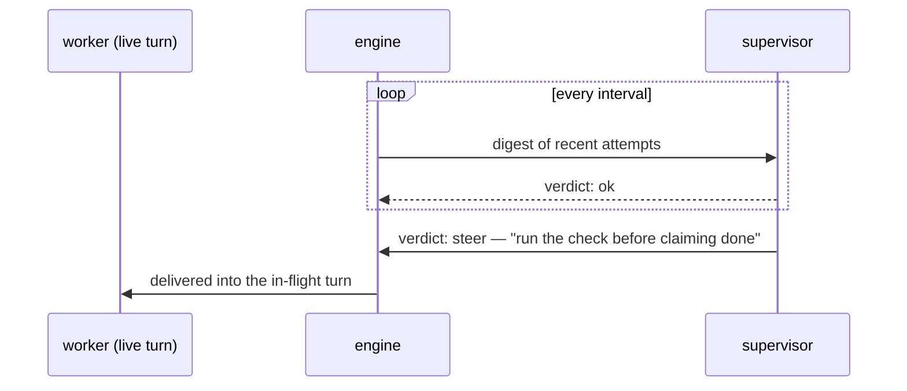

<div align="center">


# Gimble

**Run coding agents as detached pipelines.**
An agent does the work, a command decides when it's done, and a
supervisor keeps watch — long after you close your laptop.

[Specification](docs/spec.md) · [Examples](examples/README.md) ·
[Implementation notes](docs/implementation-notes.md) ·
[Direction](docs/direction.md) · [Go workflows](docs/workflows-as-programs.md) ·
[Agent reference](llms.txt)

</div>

---

## What it is

A pipeline is a small typed graph in a YAML or JSON file. Gimble runs it
as a **detached local process** driving the real Claude Code, Codex, and
Gemini CLIs, so the run survives the session that launched it — reconnect
any time to inspect, steer, or stop it. Every prompt, response, and routing
decision lands in a browsable run directory.

A loop is two nodes pointing at each other:

```yaml
- id: implement
  type: agent
  max_visits: 5
  prompt: $goal
  edges: [{to: check}]

- id: check
  type: command
  command: ./run_tests.sh
  edges:
    success: success
    error: implement
```

The agent works. The command decides. Failure routes back. `max_visits` is
the budget.

The [canonical checklist-loop example](examples/loops/canonical/README.md)
runs the shipped `sprint-execute` workflow against a deliberately broken Go
CLI. Real agents repair it across two sprints. The same workflow is the live
acceptance case for every new build, launched by `TestCanonicalLoop`.

## Why

Gimble serves [five arts of orchestration](docs/five-arts.md): making an agent
actually do the work, splitting the work so no agent carries too much, helping
a human define it, showing how it is going, and letting an observer steer it.
They compete, and the document says how.


- **Completion follows the evidence.** In a command-gated loop, the exit code
  selects the route. In a checklist loop, commands supply evidence, the item
  judge assesses inferred checks, and the goal evaluator decides whether the
  promised work is satisfied.
- **The engine starts the software, so nothing else picks the target.** A
  workflow may omit service configuration or name one Procfile and one service.
  Gimble runs the Procfile through Overmind for the workflow's lifetime and
  exports the named process's port as `GIMBLE_SERVICE_PORT` to every workflow
  shell. A service that never accepts connections fails before work begins.
- **Routing belongs to the agent, not the engine.** Each turn answers a
  schema-enforced choice of offered successors — the engine never parses
  prose, and an agent can't pick a route it wasn't offered.
- **A typo can never silently change a run.** The graph language is closed
  and typed; unknown fields are parse errors, and `start_run` lints the
  whole graph before a single token burns.
- **Real harnesses, not raw APIs.** Native sessions, steering, and
  compaction from the CLIs the models were actually trained on — and
  cross-model fan-out (isolated git worktrees, judged fan-in) in one file.

## The supervisor

The part we're proudest of: a `supervisor` node lives **in the graph but
outside the walk**. It patrols on its own clock, reads digests of the nodes
it watches, and can steer a worker's *live, in-flight turn* — one model
coaching another mid-thought. It is strictly advisory: it never routes,
nothing it does can fail the run, and a quiet scope costs zero tokens.


Under the hood, steering is just HTTP over the run's unix socket — humans
can use the same channel with `curl`:



## Install

Gimble is one Go binary plus a plugin that works in both Codex and Claude
Code (shared skills, shared MCP server).

**Codex:**

```sh
curl -fsSL https://raw.githubusercontent.com/tylergannon/gimble/main/scripts/install.sh | sh
```

**Claude Code:**

```sh
go install github.com/tylergannon/gimble/cmd/gimble@latest
claude plugin marketplace add tylergannon/gimble
claude plugin install gimble@gimble
```

Start a new session after installing so the plugin picks up `gimble mcp`.
Details and caveats: [implementation notes](docs/implementation-notes.md).

## Start from an example

Copy one into a git repo, change the goal and the check, run it:

| You want | Example |
| --- | --- |
| "Don't stop until it actually works" | [`fix-until-green.yaml`](examples/loops/fix-until-green.yaml) |
| "Keep working after I leave" | [`milestone-loop.yaml`](examples/loops/milestone-loop.yaml) |
| "Work through this list, prove each item" | [`checklist-loop.yaml`](examples/loops/checklist-loop.yaml) |
| "Try a few approaches, keep the best" | [`bake-off.yaml`](examples/loops/bake-off.yaml) |
| "Have another model check this" | [`critique-circle.yaml`](examples/loops/critique-circle.yaml) |
| Live supervision, steering, parallel fan-out | [`examples/`](examples/README.md) |

## Or run a workflow that already ships

The examples above are single shapes to copy and edit. Whole workflows ship
inside the binary and run by name, with nothing to copy:

```sh
gimble workflows                       # what this binary carries
gimble workflows show sprint-execute   # the pipeline itself
gimble run sprint-execute --workdir . --logs .gimble/run
```

| The situation | Workflow | What it works on |
| --- | --- | --- |
| A sprint ledger is planned and you want it worked to done | `sprint-execute` | `docs/sprints/ledger.md` |
| A chapter's worth of work should run as one long run | `chapter-loop` | `docs/chapters/ledger.md` |
| The next sprint needs planning properly | `sprint-plan` | `--goal`, the seed |
| A specification exists and you want software from it | `delivery-loop` | `--goal`, naming the spec |

`--goal` replaces the pipeline's goal, so every `$goal` in a prompt expands to
yours. Every workflow carries it into its working prompts, so a goal always
steers:

```sh
gimble run delivery-loop --goal "Build what docs/SPEC.md describes" \
  --workdir . --logs .gimble/run
```

Two of them are meaningless without it — there is no seed to plan and no
specification to build — so they refuse to start without one rather than
running against the generic goal in their file, and `gimble workflows` marks
them. The other two already know their work: a ledger names every sprint. For
those a goal is a steer, not the assignment, and the listing names the file
each one reads so a missing ledger is a known precondition rather than a
surprise on the first node.

None of them hardcodes a test command. The mechanical proof of an item is the
command that item carries, which the engine runs, so these work in a repository
of any language.

A name resolves to a built-in only when no file of that name exists, so a
pipeline on disk is never shadowed. `gimble workflows show <name> > mine.yaml`
gives you an ordinary pipeline to edit. The [workflow
reference](internal/workflows/README.md) says what they have in common and how
to adapt one.

The [spec](docs/spec.md) is the sole normative definition of Gimble's
Attractor variant; where anything else disagrees with it, the spec governs.

## Ask and answer inside a run

An agent can leave a Markdown or HTML question in an interview directory and
block until its caller answers. Inside a run, Gimble sets `GIMBLE_RUN_DIR`
so `ask` also appends a `QuestionAsked` event to the timeline.

```sh
GIMBLE_INTERVIEW_DIR=ephemeral/projects/my-build/interview \
gimble ask question.md

gimble answer ephemeral/projects/my-build/interview/0001.md "Use the simpler option."
```

`gimble ask --help` documents the polling behavior and the `--into` override.
`gimble answer` also accepts the answer on stdin and refuses to replace an
existing answer file.

## A run that tells you when it has news

Start a run from inside an agent session and the run outlives the turn that
started it: the session goes idle while the run keeps working. Gimble records
the launching session in the run manifest and delivers a rollup of what
happened back into it, which wakes an idle session the way any message does.

```sh
gimble run sprint-execute --workdir . --logs .gimble/run   # wakes a background session
gimble run sprint-execute --wake=on --logs .gimble/run     # wakes this session too
gimble run sprint-execute --wake=off --logs .gimble/run    # never wakes anybody
```

Waking is on an interval — `--wake-interval`, four minutes by default — and a
wake happens only when the run has something the session has not been told
already, so a quiet run never interrupts. The run's ending is always delivered.
`auto`, the default, wakes a session started in the background and leaves an
interactive one alone: that session belongs to a human who is using it, so
waking it is `--wake=on`. Nothing about a run depends on a wake landing; a
session that is gone is recorded on the timeline and the run carries on.

The manifest records which session launched a run but never the credential to
reach it, so a run directory stays safe to hand over as evidence.

In Codex desktop, Gimble uses the public `codex queue` command as the host
channel. The launching task supplies its exact thread ID; whenever the existing
wake service has bounded run news, the detached runner queues that digest as a
user message for the parent. A loaded idle task starts the turn immediately,
while a busy task keeps the message queued until it becomes idle. An unloaded
task retains queued input until it is resumed. Queue failures are recorded in
the run timeline and never fail the pipeline.

## Run one prompt

`gimble run-prompt` runs one coding-agent turn with real tool access. It
prints ordinary assistant text by default. When invoked from Codex without an
explicit model it selects Fable; when invoked from Claude Code it selects GPT.
Explicit model flags always win.

```sh
gimble run-prompt --workdir . "Explain the failing test."

gimble run-prompt --model gpt --model-version 5.6 --effort max \
  --output-schema '{"type":"object","properties":{"next":{"type":"string","enum":["fix","done"]}},"required":["next"],"additionalProperties":false}' \
  "Decide whether this change still needs work."
```

`--output-schema` accepts exact JSON Schema and changes stdout to validated
JSON. Without it there is no structured result and no `next` field.

## Edit a pipeline in the browser

`gimble edit <pipeline.yaml>` serves a graph editor for one file on loopback:
nodes, edges, an inspector for every node type, and the same lint as
`gimble validate`, saved back to the YAML with comments and key order intact.
The page reloads when an agent or another editor writes the file, so both can
work on it at once. See the [editor guide](src/content/docs/editor.md).

## License

[MIT](LICENSE).
