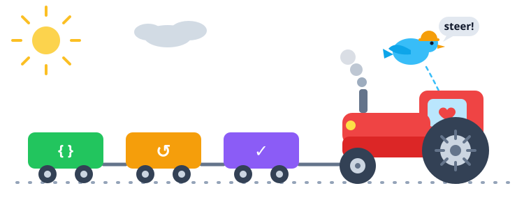
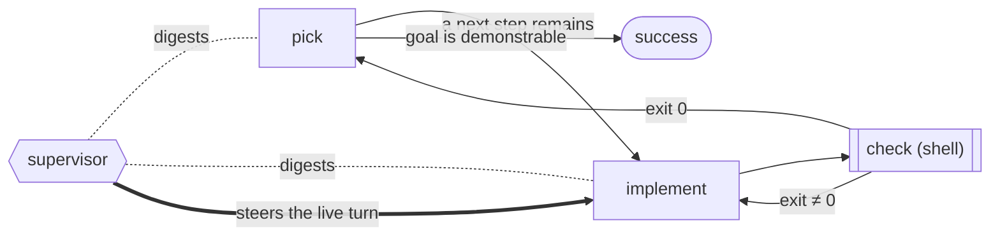
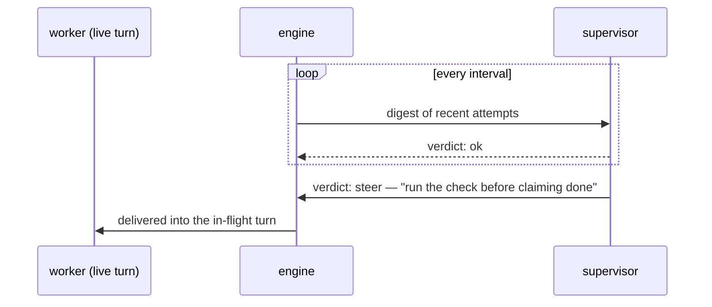

<div align="center">



# Tractor

**Run coding agents as detached pipelines.**
An agent does the work, a command decides when it's done, and a
supervisor keeps watch — long after you close your laptop.

[Specification](docs/spec.md) · [Examples](examples/README.md) ·
[Implementation notes](docs/implementation-notes.md) ·
[Agent reference](llms.txt)

</div>

---

## What it is

A pipeline is a small typed graph in a YAML or JSON file. Tractor runs it
as a **detached local process** driving the real Claude Code, Codex, and
Gemini CLIs, so the run survives the session that launched it — reconnect
any time to inspect, steer, or stop it. Every prompt, response, and routing
decision lands in a browsable run directory.

A loop is two nodes pointing at each other:

```yaml
- id: implement
  type: codergen
  max_visits: 5
  prompt: $goal
  edges: [{to: check}]

- id: check
  type: tool
  tool_command: ./run_tests.sh
  on_success: success
  on_error: implement
```

The agent works. The command decides. Failure routes back. `max_visits` is
the budget.

## Why

- **"Done" is an exit code, not an agent's opinion.** Deterministic tool
  nodes end loops; models never grade their own homework.
- **Routing belongs to the agent, not the engine.** Each turn answers a
  schema-enforced choice of offered successors — the engine never parses
  prose, and an agent can't pick a route it wasn't offered.
- **A typo can never silently change a run.** The graph language is closed
  and typed; unknown fields are parse errors, and `start_run` lints the
  whole graph before a single token burns.
- **Real harnesses, not raw APIs.** Native sessions, steering, and
  compaction from the CLIs the models were actually trained on — and
  cross-model fan-out (isolated git worktrees, judged fan-in) in one file.

## The supervisor

The part we're proudest of: a `supervisor` node lives **in the graph but
outside the walk**. It patrols on its own clock, reads digests of the nodes
it watches, and can steer a worker's *live, in-flight turn* — one model
coaching another mid-thought. It is strictly advisory: it never routes,
nothing it does can fail the run, and a quiet scope costs zero tokens.



Under the hood, steering is just HTTP over the run's unix socket — humans
can use the same channel with `curl`:



## Install

Tractor is one Go binary plus a plugin that works in both Codex and Claude
Code (shared skills, shared MCP server).

**Codex:**

```sh
curl -fsSL https://raw.githubusercontent.com/tylergannon/tractor/main/scripts/install.sh | sh
```

**Claude Code:**

```sh
go install github.com/tylergannon/tractor/cmd/tractor@latest
claude plugin marketplace add tylergannon/tractor
claude plugin install tractor@tractor
```

Start a new session after installing so the plugin picks up `tractor mcp`.
Details and caveats: [implementation notes](docs/implementation-notes.md).

## Start with a plan

When the job is not already a small, settled change, let Tractor interview you
before choosing a pipeline. Put the initial request in a seed file, then list
the workflows in your installed binary and run `plan` from the repository:

```sh
tractor workflow list
tractor workflow run plan \
  --project my-build \
  --seed seed.md
```

Before starting, Tractor prints `Logs: <absolute-path>`. By default that fresh
directory is under `$XDG_STATE_HOME/tractor/workflow-runs/`, or
`~/.local/state/tractor/workflow-runs/` when `XDG_STATE_HOME` is unset; pass
`--logs <empty-directory>` to put it elsewhere. Watch its `timeline.jsonl` for
`QuestionAsked`, open each event's `question` path, and answer it with
`tractor answer <question-path> [text]`.

When the interview finishes, Tractor prints paths to `brief.md`,
`checklist.md`, and `recommendation.md` under
`ephemeral/projects/my-build/`, followed by `Size:` and the exact `Next:`
command. Run that command from the same repository (or add the same
`--workdir` used for planning):

```sh
tractor workflow run medium --project my-build
# or, for a multi-chapter plan:
tractor workflow run large --project my-build
```

SIMPLE means execute the checklist yourself. MEDIUM means more than one sprint
but fewer than two chapters: one loop implements and validates every item in
`checklist.md`. LARGE means multiple chapters: an outer loop plans each chapter
into its sprint ledger, and a nested loop implements and validates those
sprints. Each command is one foreground Tractor run for the whole execution;
it never launches a run per item or chapter.

The execution run may ask a blocking reviewer question when a validator is
missing, repeated validation exposes a material issue, or a LARGE chapter
cannot be planned from its document. Answer the resulting `QuestionAsked`
event exactly as during planning. The loop engine runs each item's `command`
and then its `infer` judge, writes `validation.log` and `validation.json` in
the loop stage, and is the only writer of `done: true`. A failed validation
leaves the item open for the next lap.

## Start from an example

Copy one into a git repo, change the goal and the check, run it:

| You want | Example |
| --- | --- |
| "Don't stop until it actually works" | [`fix-until-green.yaml`](examples/loops/fix-until-green.yaml) |
| "Keep working after I leave" | [`milestone-loop.yaml`](examples/loops/milestone-loop.yaml) |
| "Work through this list, prove each item" | [`checklist-loop.yaml`](examples/loops/checklist-loop.yaml) |
| "Try a few approaches, keep the best" | [`bake-off.yaml`](examples/loops/bake-off.yaml) |
| "Have another model check this" | [`critique-circle.yaml`](examples/loops/critique-circle.yaml) |
| Live supervision, steering, parallel fan-out | [`examples/`](examples/README.md) |

The [spec](docs/spec.md) is the sole normative definition of Tractor's
Attractor variant; where anything else disagrees with it, the spec governs.

## Ask and answer inside a run

An agent can leave a Markdown or HTML question in an interview directory and
block until its caller answers. Inside a run, Tractor sets `TRACTOR_RUN_DIR`
so `ask` also appends a `QuestionAsked` event to the timeline.

```sh
TRACTOR_INTERVIEW_DIR=ephemeral/projects/my-build/interview \
tractor ask question.md

tractor answer ephemeral/projects/my-build/interview/0001.md "Use the simpler option."
```

`tractor ask --help` documents the polling behavior and the `--into` override.
`tractor answer` also accepts the answer on stdin and refuses to replace an
existing answer file.

## License

[MIT](LICENSE).
