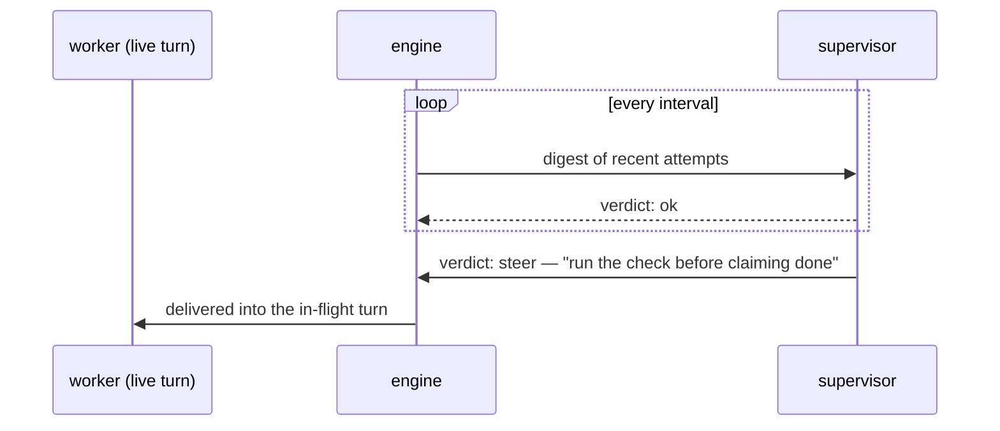

<div align="center">


# Tractor

**Run coding agents as detached pipelines.**
An agent does the work, a command decides when it's done, and a
supervisor keeps watch — long after you close your laptop.

[Specification](docs/spec.md) · [Examples](examples/README.md) ·
[Implementation notes](docs/implementation-notes.md) ·
[Agent reference](llms.txt)

</div>

---

## What it is

A pipeline is a small typed graph in a YAML or JSON file. Tractor runs it
as a **detached local process** driving the real Claude Code, Codex, and
Gemini CLIs, so the run survives the session that launched it — reconnect
any time to inspect, steer, or stop it. Every prompt, response, and routing
decision lands in a browsable run directory.

A loop is two nodes pointing at each other:

```yaml
- id: implement
  type: agent
  max_visits: 5
  prompt: $goal
  edges: [{to: check}]

- id: check
  type: command
  command: ./run_tests.sh
  edges:
    success: success
    error: implement
```

The agent works. The command decides. Failure routes back. `max_visits` is
the budget.

## Why

- **Completion follows the evidence.** In a command-gated loop, the exit code
  selects the route. In a checklist loop, commands supply evidence, the item
  judge assesses inferred checks, and the goal evaluator decides whether the
  promised work is satisfied.
- **Routing belongs to the agent, not the engine.** Each turn answers a
  schema-enforced choice of offered successors — the engine never parses
  prose, and an agent can't pick a route it wasn't offered.
- **A typo can never silently change a run.** The graph language is closed
  and typed; unknown fields are parse errors, and `start_run` lints the
  whole graph before a single token burns.
- **Real harnesses, not raw APIs.** Native sessions, steering, and
  compaction from the CLIs the models were actually trained on — and
  cross-model fan-out (isolated git worktrees, judged fan-in) in one file.

## The supervisor

The part we're proudest of: a `supervisor` node lives **in the graph but
outside the walk**. It patrols on its own clock, reads digests of the nodes
it watches, and can steer a worker's *live, in-flight turn* — one model
coaching another mid-thought. It is strictly advisory: it never routes,
nothing it does can fail the run, and a quiet scope costs zero tokens.


Under the hood, steering is just HTTP over the run's unix socket — humans
can use the same channel with `curl`:



## Install

Tractor is one Go binary plus a plugin that works in both Codex and Claude
Code (shared skills, shared MCP server).

**Codex:**

```sh
curl -fsSL https://raw.githubusercontent.com/tylergannon/tractor/main/scripts/install.sh | sh
```

**Claude Code:**

```sh
go install github.com/tylergannon/tractor/cmd/tractor@latest
claude plugin marketplace add tylergannon/tractor
claude plugin install tractor@tractor
```

Start a new session after installing so the plugin picks up `tractor mcp`.
Details and caveats: [implementation notes](docs/implementation-notes.md).

## Start from an example

Copy one into a git repo, change the goal and the check, run it:

| You want | Example |
| --- | --- |
| "Don't stop until it actually works" | [`fix-until-green.yaml`](examples/loops/fix-until-green.yaml) |
| "Keep working after I leave" | [`milestone-loop.yaml`](examples/loops/milestone-loop.yaml) |
| "Work through this list, prove each item" | [`checklist-loop.yaml`](examples/loops/checklist-loop.yaml) |
| "Try a few approaches, keep the best" | [`bake-off.yaml`](examples/loops/bake-off.yaml) |
| "Have another model check this" | [`critique-circle.yaml`](examples/loops/critique-circle.yaml) |
| Live supervision, steering, parallel fan-out | [`examples/`](examples/README.md) |

## Or run a workflow that already ships

The examples above are single shapes to copy and edit. Whole workflows ship
inside the binary and run by name, with nothing to copy:

```sh
tractor workflows                       # what this binary carries
tractor workflows show sprint-execute   # the pipeline itself
tractor run sprint-execute --workdir . --logs .tractor/run
```

| The situation | Workflow |
| --- | --- |
| A sprint ledger is planned and you want it worked to done | `sprint-execute` |
| A chapter's worth of work should run as one long run | `chapter-loop` |
| The next sprint needs planning properly | `sprint-plan` |
| A specification exists and you want software from it | `delivery-loop` |
| One repository promise needs advancing and a verdict recording | `promise-loop` |

A name resolves to a built-in only when no file of that name exists, so a
pipeline on disk is never shadowed. `tractor workflows show <name> > mine.yaml`
gives you an ordinary pipeline to edit. The [workflow
reference](internal/workflows/README.md) says what they have in common and how
to adapt one.

The [spec](docs/spec.md) is the sole normative definition of Tractor's
Attractor variant; where anything else disagrees with it, the spec governs.

## Ask and answer inside a run

An agent can leave a Markdown or HTML question in an interview directory and
block until its caller answers. Inside a run, Tractor sets `TRACTOR_RUN_DIR`
so `ask` also appends a `QuestionAsked` event to the timeline.

```sh
TRACTOR_INTERVIEW_DIR=ephemeral/projects/my-build/interview \
tractor ask question.md

tractor answer ephemeral/projects/my-build/interview/0001.md "Use the simpler option."
```

`tractor ask --help` documents the polling behavior and the `--into` override.
`tractor answer` also accepts the answer on stdin and refuses to replace an
existing answer file.

## Run one prompt

`tractor run-prompt` runs one coding-agent turn with real tool access. It
prints ordinary assistant text by default. When invoked from Codex without an
explicit model it selects Fable; when invoked from Claude Code it selects GPT.
Explicit model flags always win.

```sh
tractor run-prompt --workdir . "Explain the failing test."

tractor run-prompt --model gpt --model-version 5.6 --effort max \
  --output-schema '{"type":"object","properties":{"next":{"type":"string","enum":["fix","done"]}},"required":["next"],"additionalProperties":false}' \
  "Decide whether this change still needs work."
```

`--output-schema` accepts exact JSON Schema and changes stdout to validated
JSON. Without it there is no structured result and no `next` field.

## Edit a pipeline in the browser

`tractor edit <pipeline.yaml>` serves a graph editor for one file on loopback:
nodes, edges, an inspector for every node type, and the same lint as
`tractor validate`, saved back to the YAML with comments and key order intact.
The page reloads when an agent or another editor writes the file, so both can
work on it at once. See the [editor guide](src/content/docs/editor.md).

## License

[MIT](LICENSE).
