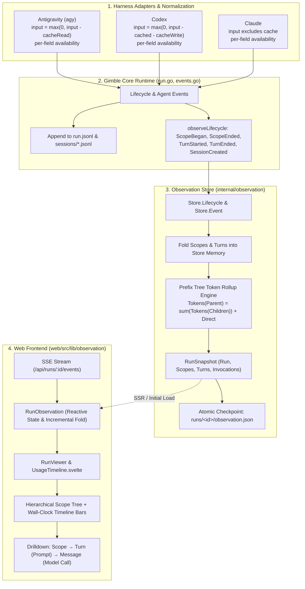
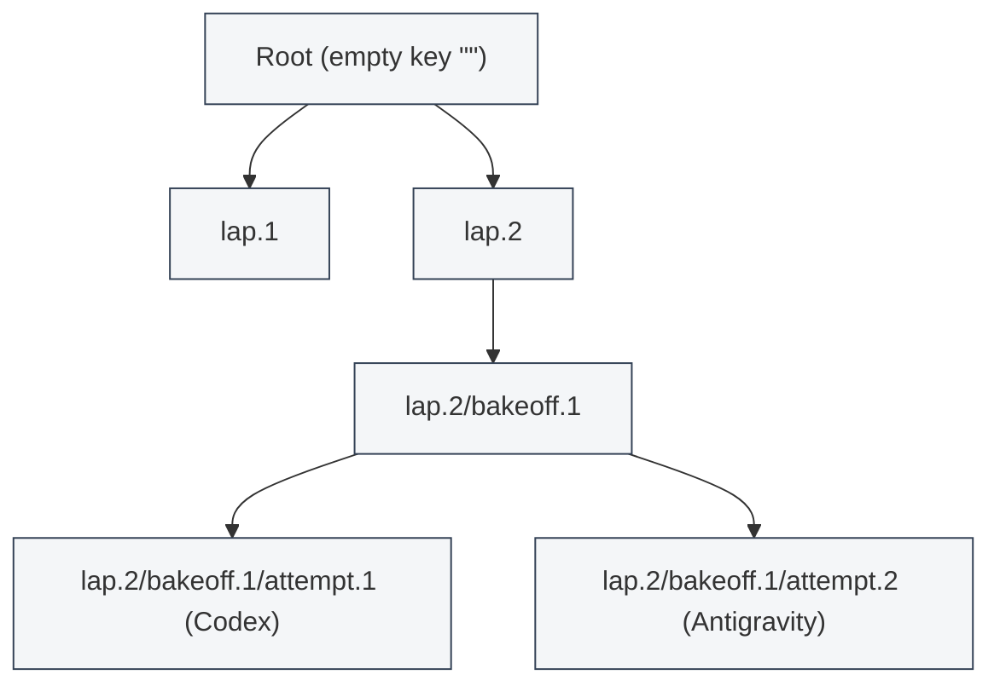

# SPRINT-001: Token Usage by Scope

## Overview

Sprint 001 introduces hierarchical token accounting and timeline inspection across workflow scopes in Gimble. Currently, while raw token metrics are captured at the individual model-call grain across Claude, Codex, and Antigravity harnesses, they remain isolated on assistant message rows in a flat turn list (`RunViewer.svelte`). The run observation checkpoint (`observation.json`) lacks scopes and turns entirely; the UI cannot aggregate token consumption across scopes or laps; Antigravity double-counts cached tokens in its input tally; and missing provider fields cause token availability to collapse to "unavailable" for entire models.

This sprint delivers end-to-end scope and turn lifecycle awareness, consistent normalized token accounting, hierarchical prefix-tree token rollups (categorized by model and split by new input, cache read, cache write, output, and reasoning), and an interactive tree-and-timeline inspection view for both live streaming and post-run checkpoint review.



---

## Use Cases

### 1. Post-Run Cost & Token Forensic Analysis
A developer or agent inspects a completed multi-lap workflow (e.g., a sprint loop or a bakeoff). By opening `/runs/[runID]`, they immediately see:
- Total run token expenditure broken down by model (e.g., `gemini-3.8-flash`, `gpt-5.6-luna`, `claude-haiku-4-5-20251001`).
- Per-scope token aggregations at every layer of the prefix hierarchy (`lap.1`, `lap.2/bakeoff.1`, `lap.2/bakeoff.1/attempt.1`), revealing exactly which lap or candidate consumed the budget.
- Clear distinction between fresh input tokens, cache reads, cache writes, output tokens, and reasoning tokens.

### 2. Live Run Scope Monitoring & Bottleneck Identification
During an active workflow execution, an observer watches the run page update in real time via SSE:
- New scopes (`scope_began`) appear dynamically in the tree hierarchy with live duration timers and active status badges.
- Concurrently executing sibling scopes (e.g., bakeoff attempts running in parallel via `Group.Go`) render side-by-side or stacked on the wall-clock timeline.
- As turns finish, token tallies incrementally roll up the tree, allowing immediate identification of runaway reasoning loops or prompt bloat before the run terminates.

### 3. Drill-Down from Scope to Turn Prompt and Message Transcript
From an aggregate scope card:
- Clicking a scope expands its child scopes and constituent turns.
- Each turn displays its prompt or structured task assignment, output type, execution duration, and per-turn token total.
- Expanding a turn reveals its individual assistant messages and tool calls, with granular model-call tokens matching the aggregate numbers above.

### 4. Headless & Offline Inspection from Checkpoint Alone
A CI job, script, or post-mortem agent reads `runs/<id>/observation.json` directly without running a browser or SvelteKit runtime:
- The checkpoint file contains the complete run status, registered sessions, folded scopes with lifecycle timestamps and tasks, turns with prompts and durations, and invocation snapshots.
- Scope token rollups can be verified or processed directly from the JSON artifact.

---

## Architecture

### 1. Scope Tree Structure & Prefix Containment

In Gimble, scope keys are slash-delimited paths of constant names and runtime ordinals, established at the call site:
```text
lap.1
lap.1/coder.1
lap.2
lap.2/bakeoff.1
lap.2/bakeoff.1/attempt.1
lap.2/bakeoff.1/attempt.2
```

Containment is strictly prefix-based:
- Scope key $S_1$ contains scope or invocation $S_2$ if and only if $S_2 = S_1$ or $S_2$ starts with $S_1 + "/"$.
- The root scope key is empty string `""`, which prefixes every scope and invocation in the run.
- Sibling scopes share an immediate parent key (`parent(key)` is the key minus its final path segment).
- Sibling scopes whose `[began, ended]` time intervals overlap executed concurrently (via `Group.Go`); siblings whose intervals do not overlap executed sequentially (e.g., iterative `Loop` laps).



### 2. Token Normalization & Accounting Semantics

To ensure fair comparisons across providers, token metrics emitted in `session.step.ended` and recorded in native provenance must adhere to uniform semantics:

```text
total_tokens = input (new) + cache_read + cache_write + output + reasoning
```

| Metric | Definition | Antigravity (`agy`) | Codex | Claude |
|---|---|---|---|---|
| **Input (New)** | Fresh, non-cached prompt tokens | `max(0, input_tokens - cache_read_tokens)` *(Fixed)* | `max(0, inputTokens - cached - cacheWrite)` | `input_tokens` (already excludes cache) |
| **Cache Read** | Tokens retrieved from prompt cache | `cache_read_tokens` | `cachedInputTokens` | `cache_read_input_tokens` |
| **Cache Write** | Tokens written to prompt cache | `0` (or `cache_write_tokens` if present) | `cacheWriteInputTokens` | `cache_creation_input_tokens` |
| **Output** | Visible generated response tokens | `max(0, output_tokens - thinking_tokens)` | `max(0, outputTokens - reasoning)` | `max(0, output_tokens - thinking)` |
| **Reasoning** | Internal thought tokens | `thinking_tokens` | `reasoningOutputTokens` | `output_tokens_details.thinking_tokens` |

#### Decoupled Per-Field Availability
Earlier implementations computed:
```go
available = inputOK && outputOK && reasoningOK && cacheReadOK && cacheWriteOK
```
Because Gemini/Antigravity does not report `cache_write_tokens`, `cacheWriteOK` was false, forcing `tokensAvailable = false` and causing the UI to render `tokens unavailable` despite thousands of measured tokens.

The new model decouples availability:
1. `tokensAvailable = inputOK && outputOK`: Core usage is present.
2. `fieldAvailability`: Explicit boolean flags per metric (`input`, `output`, `reasoning`, `cacheRead`, `cacheWrite`).
3. If a field is unavailable (e.g. `cacheWrite: false`), the UI displays it as unavailable (`—`) rather than `0`, while fully displaying and summing available fields.

### 3. Data Model Extensions (`internal/observation` & `events.go`)

#### Observation Store Go Types (`internal/observation/snapshot.go`)
```go
// ScopeInfo records one scope instance's metadata and lifecycle.
type ScopeInfo struct {
    Key       string     `json:"key"`
    Name      string     `json:"name"`
    Parent    string     `json:"parent"`
    Task      *TaskInfo  `json:"task,omitempty"`
    Began     time.Time  `json:"began"`
    Ended     *time.Time `json:"ended,omitempty"`
    Error     string     `json:"error,omitempty"`
}

// TaskInfo carries structured loop task metadata if the scope was a task.
type TaskInfo struct {
    Summary   string `json:"summary"`
    Goal      string `json:"goal,omitempty"`
}

// TurnInfo records one agent turn's lifecycle, prompt, and execution status.
type TurnInfo struct {
    ID          string        `json:"id"`
    Scope       string        `json:"scope"`
    Session     string        `json:"session"`
    Prompt      string        `json:"prompt"`
    OutputType  string        `json:"output_type"`
    Started     time.Time     `json:"started"`
    Ended       *time.Time    `json:"ended,omitempty"`
    Duration    time.Duration `json:"duration,omitempty"`
    Error       string        `json:"error,omitempty"`
    Interrupted bool          `json:"interrupted,omitempty"`
}

// TokenTotals aggregates token consumption for a model or scope.
type TokenTotals struct {
    InputNew   int64 `json:"inputNew"`
    CacheRead  int64 `json:"cacheRead"`
    CacheWrite int64 `json:"cacheWrite"`
    Output     int64 `json:"output"`
    Reasoning  int64 `json:"reasoning"`
    Total      int64 `json:"total"`
}

// ModelUsage aggregates totals and field availability for one model within a scope.
type ModelUsage struct {
    Model             string            `json:"model"`
    ProviderID        string            `json:"providerID"`
    Totals            TokenTotals       `json:"totals"`
    FieldAvailability map[string]bool   `json:"fieldAvailability"`
}

// ScopeUsageRollup carries rolled-up token usage for a scope across all models.
type ScopeUsageRollup struct {
    Models map[string]ModelUsage `json:"models"`
    Totals TokenTotals           `json:"totals"`
}

// RunSnapshot is extended with Scopes and Turns.
type RunSnapshot struct {
    Run         RunInfo               `json:"run"`
    Scopes      map[string]ScopeInfo  `json:"scopes"`
    Turns       map[string]TurnInfo   `json:"turns"`
    Invocations map[string]Invocation `json:"invocations"`
}
```

#### Lifecycle Folding in `internal/observation/store.go`
`Store.Lifecycle(entry Lifecycle)` folds:
- `scope_began`: Creates or updates `s.scopes[entry.Placement.Scope]` with `Began`, `Name`, `Parent`, `Task`.
- `scope_ended`: Sets `Ended` and `Error` on `s.scopes[entry.Placement.Scope]`.
- `turn_started`: Creates `s.turns[entry.Placement.Turn]` with `Prompt`, `OutputType`, `Started`.
- `turn_ended`: Updates `s.turns[entry.Placement.Turn]` with `Ended`, `Duration`, `Error`, `Interrupted`.

### 4. Hierarchical Rollup Engine (Go & TypeScript)

Token totals are derived directly from the assistant messages across invocations:
1. Every assistant message in `invocation.Snapshot.State.Message` with `tokens` is visited.
2. The message belongs to `invocation.Placement.Scope`, which identifies the scope instance.
3. The message's tokens are added to `scopeUsage[scopeKey]` for `message.model.id`.
4. Prefix Rollup: For each scope key $S$, all tokens in any scope $T$ where $T = S$ or $\text{strings.HasPrefix}(T, S + "/")$ are rolled up into $S$.
5. Reconciliation Invariant:
   $$\text{Totals}(S) = \sum_{C \in \text{DirectChildren}(S)} \text{Totals}(C) + \text{DirectTotals}(S)$$
   Every child sum reconciles exactly with its parent.

Both Go (`internal/observation`) and TypeScript (`web/src/lib/observation`) implement identical rollup logic:
- Go computes it on snapshot generation and persists it in `observation.json`.
- TypeScript maintains the rollup reactively on `RunObservation` as event and lifecycle frames stream in.

### 5. Frontend Visual Layout & Timeline Architecture

The run viewer (`RunViewer.svelte`) transitions from a flat turn transcript to a hierarchical view:

```text
+-----------------------------------------------------------------------------------+
| Run: sprint-001-run-prompt          Status: completed          Duration: 1m 24s   |
| Total Tokens: 45,210  (New: 32,100 | Cache Read: 10,000 | Output: 3,110)          |
+-----------------------------------------------------------------------------------+
| [ View: All Scopes | By Model | Flat Transcript ]                                 |
+-----------------------------------------------------------------------------------+
| Scope / Turn Tree                         Timeline [0s ------------ 84s]          |
|-----------------------------------------------------------------------------------|
| [-] Root                                  [==============================] 45.2k |
|   |-- [+] lap.1                           [========]                       12.1k |
|   `-- [-] lap.2                           [                 =============] 33.1k |
|         `-- [-] bakeoff.1                 [                 =============] 33.1k |
|               |-- [*] attempt.1 (Codex)   [                 ======       ] 15.4k |
|               |     Turn 1: "Write code"  [                 ===          ]       |
|               |     Turn 2: "Run tests"   [                    ===       ]       |
|               `-- [*] attempt.2 (AGY)     [                 =============] 17.7k |
|                     Turn 1: "Write code"  [                 ====         ]       |
|                     Turn 2: "Run tests"   [                      ========]       |
+-----------------------------------------------------------------------------------+
| Selected Item Details: attempt.2 / Turn 1                                         |
| Prompt: "Implement token rollup in internal/observation..."                       |
| Tokens: 14,980 input (new) | 0 cache read | — cache write | 124 output           |
| [Assistant Message Transcript & Tool Calls ...]                                   |
+-----------------------------------------------------------------------------------+
```

Key UI components:
- `UsageSummaryHeader.svelte`: Global run tokens per model, cached/new split, availability badges.
- `ScopeTreeTimeline.svelte`: Collapsible tree view combined with SVG/CSS timeline bars. Siblings that overlap in time render stacked to visualize concurrency (`Group.Go`).
- `TokenBar.svelte`: Proportional horizontal segmented bar displaying `inputNew` (blue), `cacheRead` (cyan), `cacheWrite` (purple), `output` (green), `reasoning` (amber).
- `TurnDetail.svelte`: Displays turn prompt, task assignment, duration, error status, and links to message transcript.

---

## Implementation Plan

### Phase 1: Adapter Normalization & Per-Field Availability

- **Files**:
  - `agy/events.go`
  - `agy/events_test.go`
  - `codex/events.go`
  - `codex/events_test.go`
  - `claude/events.go`
  - `claude/events_test.go`
- **Tasks**:
  1. In `agy/events.go`:
     - Update `normalizeUsage`: calculate `input = max(0, input_tokens - cache_read_tokens)`.
     - Update availability calculation: decouple `available` from `cacheWriteOK`. Set `available = inputOK && outputOK`.
     - Ensure `fieldAvailability` accurately reflects `cacheWrite: false` without invalidating the entire accounting payload.
  2. In `codex/events.go` & `claude/events.go`:
     - Ensure `available` is true when `inputOK && outputOK`, allowing individual missing optional fields (e.g. reasoning or cache write) to degrade gracefully in `fieldAvailability`.
  3. Update adapter unit tests to verify:
     - Antigravity cached token subtraction (`input_tokens=15000, cache_read=5000 => input=10000`).
     - Availability flags with missing cache write.
     - Zero tokens vs unavailable tokens.

### Phase 2: Observation Store & Snapshot Extension (Go)

- **Files**:
  - `run.go`
  - `event_persistence.go`
  - `internal/observation/snapshot.go`
  - `internal/observation/store.go`
  - `internal/observation/checkpoint.go`
  - `internal/observation/store_test.go`
- **Tasks**:
  1. Define `ScopeInfo`, `TurnInfo`, `TokenTotals`, and `ModelUsage` structs in `internal/observation/snapshot.go`.
  2. Add `Scopes map[string]ScopeInfo` and `Turns map[string]TurnInfo` to `RunSnapshot`.
  3. Expand `observation.Lifecycle` struct with typed fields for scope and turn records:
     - `ScopeBegan *ScopeBeganInfo`
     - `ScopeEnded *ScopeEndedInfo`
     - `TurnStarted *TurnStartedInfo`
     - `TurnEnded *TurnEndedInfo`
  4. In `run.go:observeLifecycle`:
     - Map `ScopeBegan`, `ScopeEnded`, `TurnStarted`, and `TurnEnded` events to the corresponding `observation.Lifecycle` entry fields.
  5. In `internal/observation/store.go`:
     - Implement scope and turn folding in `Store.Lifecycle()`.
     - Implement `ScopeRollupLocked()`: builds the prefix tree, aggregates tokens from all child messages and turns per model and per metric.
     - Include folded scopes and turns in `snapshotLocked()`.
  6. In `internal/observation/checkpoint.go`:
     - Ensure `loadCheckpoint` and `writeCheckpoint` round-trip `Scopes` and `Turns` cleanly with zero data loss.
  7. Add unit tests in `internal/observation/store_test.go`:
     - Test lifecycle folding of `ScopeBegan`, `ScopeEnded`, `TurnStarted`, `TurnEnded`.
     - Test token rollup across nested scopes (`a`, `a/b`, `a/b/c`) and verify parent totals equal child sums.
     - Test checkpoint persistence and re-loading of scopes and turns.

### Phase 3: Web Observation State & Reducer Alignment (TypeScript)

- **Files**:
  - `web/src/lib/observation/index.ts`
  - `web/src/lib/observation/index.test.ts`
  - `web/src/hooks.ts`
- **Tasks**:
  1. Update TypeScript definitions in `web/src/lib/observation/index.ts`:
     - Add `ScopeInfo`, `TurnInfo`, `TokenTotals`, `ModelUsage`, `ScopeUsageRollup`.
     - Update `RunSnapshot` with `scopes: Record<string, ScopeInfo>` and `turns: Record<string, TurnInfo>`.
  2. Extend `foldLifecycle` in `index.ts`:
     - Fold `scope_began` and `scope_ended` into `observation.scopes`.
     - Fold `turn_started` and `turn_ended` into `observation.turns`.
  3. Implement reactive `rollupUsage(observation: RunObservation)` in TypeScript:
     - Aggregates assistant message tokens by scope prefix and model.
     - Returns immutable rollup map `Record<string, ScopeUsageRollup>`.
  4. Refactor `accounting()` in `index.ts`:
     - Format per-field breakdown (`input`, `cacheRead`, `cacheWrite`, `output`, `reasoning`).
     - Render `—` for unavailable fields instead of blank or zero.
  5. Add unit tests in `web/src/lib/observation/index.test.ts`:
     - Test `foldLifecycle` for scope and turn records.
     - Test rollup math and prefix aggregation in TypeScript.
     - Test accounting string formatter with partial field availability.

### Phase 4: UI Components & Hierarchical Timeline

- **Files**:
  - `web/src/lib/observation/RunViewer.svelte`
  - `web/src/lib/observation/UsageSummaryHeader.svelte` (new)
  - `web/src/lib/observation/ScopeTreeTimeline.svelte` (new)
  - `web/src/lib/observation/TokenBar.svelte` (new)
  - `web/src/lib/observation/TurnDetail.svelte` (new)
  - `web/src/lib/observation/MessageRow.svelte`
  - `web/src/lib/observation/SessionTimeline.svelte`
- **Tasks**:
  1. Build `UsageSummaryHeader.svelte`:
     - Displays run name, status, duration, total tokens, and per-model summary cards.
  2. Build `TokenBar.svelte`:
     - Stacked color bar indicating ratio of new input, cache read, cache write, output, reasoning.
  3. Build `ScopeTreeTimeline.svelte`:
     - Tree table layout with expand/collapse nodes.
     - Horizontal time axis representing total run elapsed time.
     - Scope duration bar positioned via CSS `left` and `width` percentages.
     - Sibling overlap detection for concurrent groups (stacked display).
     - Token metrics badge with hover tooltip showing model breakdown.
  4. Build `TurnDetail.svelte`:
     - Displays turn prompt, output type, duration, status, and associated session info.
     - Expands to show child `MessageRow` components.
  5. Refactor `RunViewer.svelte`:
     - Integrate `UsageSummaryHeader` and `ScopeTreeTimeline`.
     - Provide view toggles: "Hierarchy & Timeline", "By Model", "Flat Invocations".
  6. Update `MessageRow.svelte`:
     - Modernize token display in footer using structured token pill instead of raw JSON string.

### Phase 5: Verification, Proof Run & Attestation

- **Files**:
  - `gimble_test.go`
  - `events_test.go`
  - `ephemeral/attest/sprint-001/` (proof artifacts & scripts)
- **Tasks**:
  1. Go Fake Adapter Suite:
     - Write an automated test in `gimble_test.go` running a multi-level workflow (`Scope("lap.1", ...)`, `Group("bakeoff")`, concurrent turns).
     - Assert that the resulting `observation.json` has complete scopes, turns, and reconciled token rollups.
  2. Frontend Playwright / Web Test:
     - Run `cd web && pnpm test` and `cd web && pnpm run check` to verify type safety and zero regressions.
  3. Live Proof Run on Cheap Tier:
     - Execute a real two-harness workflow using `gpt-5.6-luna` (Codex) and `gemini-3.8-flash` (Antigravity).
     - Workflow must feature:
       - Nested scopes (`benchmark.1/bakeoff.1/attempt.1` and `attempt.2`).
       - Concurrent execution via `Group.Go`.
       - Multiple turns per session.
     - Capture `observation.json` and verify token reconciliation against raw provider events.
     - Capture browser screenshot of the run page demonstrating the scope tree, timeline bars, and token rollup.

---

## Files Summary

| File Path | Action | Description |
|---|---|---|
| `agy/events.go` | Modify | Subtract `cache_read_tokens` from `input_tokens`; decouple `available` from `cacheWriteOK`. |
| `agy/events_test.go` | Modify / Add | Add unit tests for Antigravity token normalization and per-field availability. |
| `codex/events.go` | Modify | Update availability semantics to support graceful optional field degradation. |
| `codex/events_test.go` | Modify | Test partial field availability. |
| `claude/events.go` | Modify | Update availability semantics to match decoupled model. |
| `claude/events_test.go` | Modify | Test partial field availability. |
| `run.go` | Modify | Dispatch `ScopeBegan`, `ScopeEnded`, `TurnStarted`, and `TurnEnded` in `observeLifecycle`. |
| `internal/observation/snapshot.go` | Modify | Add `ScopeInfo`, `TurnInfo`, `TokenTotals`, `ModelUsage`; add `Scopes` and `Turns` to `RunSnapshot`. |
| `internal/observation/store.go` | Modify | Fold scopes and turns into store memory; implement `ScopeRollupLocked()`. |
| `internal/observation/checkpoint.go` | Modify | Ensure atomic persistence and loading of scopes and turns in `observation.json`. |
| `internal/observation/store_test.go` | Modify | Test lifecycle folding of scopes/turns and hierarchical token rollup math. |
| `web/src/lib/observation/index.ts` | Modify | Add TypeScript types for scopes/turns/rollups; extend `foldLifecycle`; implement reactive rollup. |
| `web/src/lib/observation/index.test.ts` | Modify | Unit test scope folding, token rollup reconciliation, and accounting formatting. |
| `web/src/lib/observation/RunViewer.svelte` | Modify | Refactor to host tree-timeline view, token summary header, and view toggles. |
| `web/src/lib/observation/UsageSummaryHeader.svelte` | Create | New component: global token metrics, cached/new split, and per-model summary cards. |
| `web/src/lib/observation/ScopeTreeTimeline.svelte` | Create | New component: collapsible scope tree with horizontal wall-clock timeline bars. |
| `web/src/lib/observation/TokenBar.svelte` | Create | New component: visual segmented bar for token composition (new, cache read/write, output, reasoning). |
| `web/src/lib/observation/TurnDetail.svelte` | Create | New component: displays turn prompt, duration, status, and message drilldown. |
| `web/src/lib/observation/MessageRow.svelte` | Modify | Modernize token footer to show clean per-field metrics rather than raw JSON. |
| `gimble_test.go` | Modify | Add integration test verifying end-to-end scope/turn observation and rollup math over fake adapter. |

---

## Definition of Done

In strict accordance with [`docs/definition-of-done.md`](file:///Users/tyler/src/gimble/.claude/worktrees/token-usage-by-scope-50a907/docs/definition-of-done.md), this sprint is gated entirely on realizing the requirements and demonstrating them working:

1. **Normalized Adapter Accounting**:
   - `agy` calculates non-cached input tokens as `max(0, input_tokens - cache_read_tokens)`.
   - All three adapters (`agy`, `codex`, `claude`) preserve observed input/output tokens even when cache write or reasoning metrics are unprovided by the model.
   - Missing fields render as unavailable (`—`), never masquerading as zero.

2. **Durable Scope & Turn Observation**:
   - `Store.Lifecycle` and `web/src/lib/observation/index.ts:foldLifecycle` fold `scope_began`, `scope_ended`, `turn_started`, and `turn_ended` records.
   - `RunSnapshot` and `observation.json` contain complete `scopes` (with key, name, parent, task, began, ended, error) and `turns` (with prompt, output type, started, ended, duration, error, interrupted).
   - An `observation.json` checkpoint alone without the server process is sufficient to reconstruct the entire scope tree and token rollup.

3. **Hierarchical Token Rollup & Reconciliation**:
   - For every scope in the hierarchy, token totals are calculated per model and split into new input, cache read, cache write, output, and reasoning.
   - Child scope totals sum exactly to their parent scope total:
     $$\text{Totals}(S) = \sum_{C \in \text{Children}(S)} \text{Totals}(C) + \text{DirectTotals}(S)$$

4. **Interactive Timeline & Drill-Down UX**:
   - Opening `/runs/[runID]` (live or post-run) renders the scope hierarchy and wall-clock timeline.
   - Overlapping sibling scopes (e.g. concurrent bakeoffs) visually indicate concurrency.
   - Users can drill down from scope to turn prompt, and from turn to individual assistant messages and tool calls.
   - Live streaming and finished checkpoint review share identical frontend rendering logic.

5. **Automated & Live Attestation**:
   - `go test ./...` passes, including new unit tests for adapters and store folding.
   - `cd web && pnpm test` and `cd web && pnpm run check` pass with zero errors and zero warnings.
   - A live proof workflow executed on cheap-tier models (`gpt-5.6-luna`, `gemini-3.8-flash`) demonstrates nested scopes, concurrent siblings, and reconciled token totals, verified against a captured browser screenshot.

---

## Risks & Mitigations

| Risk | Impact | Mitigation |
|---|---|---|
| **High Frequency Event Invalidation** | Streaming rapid token deltas in large runs causes UI sluggishness or excessive Svelte re-renders. | Scope rollups are derived from completed turn/message events rather than character-by-character deltas. Reactive invalidation uses coarse-grained revision bumps. |
| **Unanchored Scope Durations for Crashed Runs** | If a run or scope terminates abruptly without emitting `scope_ended`, `ended` time is null. | Fall back gracefully to the timestamp of the last observed event or the run's `ended` timestamp when rendering timeline bars. |
| **Double Counting in Deeply Nested Scope Trees** | Aggregating tokens at each parent level could accidentally double-count descendant tokens if not strictly keyed by unique message IDs. | Rollup engine aggregates unique messages by normalized message ID into their leaf scope, then computes prefix sums bottom-up. |
| **Antigravity API Discrepancies** | Future `agy` CLI versions change accounting field names or include cache creation metrics. | `normalizeUsage` continues to inspect `rawProviderAccounting` dynamically and maintains raw payloads in `NativeRef` for full forensic transparency. |
| **SSR / Embedded JS Engine Compatibility** | Complex JavaScript timeline libraries or missing globals in `skgo`'s SSR engine throw runtime errors. | Implement timeline rendering with vanilla Svelte components and pure CSS/SVG; avoid external charting dependencies. |

---

## Dependencies

- **Go 1.24+**: Root package runtime.
- **Polytype (`github.com/tylergannon/polytype`)**: Event schema generation.
- **Skgo (`github.com/tylergannon/skgo`)**: SvelteKit-Go web runtime and universal hooks.
- **Node.js 22+ & pnpm v11+**: Web application toolchain.
- **Svelte 5 & Vite Plus (`vp`)**: Web frontend rendering.
- **Harness CLIs**:
  - `codex-cli` (OpenAI / `gpt-5.6-luna`)
  - `agy` (Google / `gemini-3.8-flash`)
  - Claude Code CLI (Anthropic / `haiku`)

---

## Open Questions & Recommendations

### 1. Where should the rollup be computed: in Go, in the browser, or both?
- **Recommendation**: Compute authoritative rollups during `Store.snapshotLocked()` in Go for persistence in `observation.json` and `GET /api/runs/:id`, AND maintain a lightweight reactive equivalent in TypeScript in `RunObservation` for live SSE streaming.
- *Rationale*: External scripts, CLI inspection tools, and post-mortem agents must be able to read scope token totals directly from `observation.json` without executing JavaScript. Simultaneously, computing it client-side from incoming events prevents the server from needing to push redundant aggregate frames over SSE for every message delta.

### 2. What should the timeline draw at each level, and how does a user select the view?
- **Recommendation**: A unified, collapsible tree-timeline view (`ScopeTreeTimeline.svelte`) as the primary interface, supplemented by a view mode toggle (`Hierarchy & Timeline`, `By Model`, `Flat Transcript`).
- *Rationale*: A unified view provides immediate spatial context—seeing the scope hierarchy in the left column alongside horizontal timeline duration bars in the right column. Clicking a scope expands its children and turns inline, keeping the mental model contiguous.

### 3. Should `TurnEnded.Tokens` stay opaque `[]JSONText` or become a typed record?
- **Recommendation**: Keep `TurnEnded.Tokens` as `[]JSONText` in `events.go`.
- *Rationale*: `events.go` defines a sealed Polytype union. Modifying `TurnEnded.Tokens` risks churn across generated JSON schemas and adapters. More importantly, granular model-call tokens and model identity already arrive fully typed via `session.step.ended` and `session.step.started` into `invocations[turn].snapshot`. The observation store already has complete access to these typed records, making changes to `events.go` unnecessary.

### 4. Is a price table in scope for cost, or does this sprint stop at tokens?
- **Recommendation**: Explicitly bound cost out for Sprint 001; stop at tokens.
- *Rationale*: Provider pricing structures (input price, prompt cache hit/miss tiers, reasoning token multipliers) change frequently and introduce complex external dependencies. Tyler's seed explicitly prioritizes: *"being able to always see where the tokens are being spent, per model, cached/new, etc, would be awesome."* Accurate, normalized token numbers provide immediate engineering value without pricing guesswork.

### 5. How should Antigravity's cache read tokens be normalized?
- **Recommendation**: Define Antigravity non-cached input tokens as `max(0, input_tokens - cache_read_tokens)`.
- *Rationale*: In Gemini's API, `prompt_token_count` (`input_tokens`) includes both cached and uncached tokens. Reporting `input_tokens` as `input` alongside `cache_read_tokens` double-counts the cached prompt. Subtracting `cache_read_tokens` aligns `agy` with Codex and Claude.

### 6. What is the smallest live workflow for the proof run?
- **Recommendation**: A single test workflow with a root scope running a `benchmark` scope containing a `Group` with two concurrent attempts:
  - Attempt 1: Codex session (`gpt-5.6-luna`) generating a simple code snippet.
  - Attempt 2: Antigravity session (`gemini-3.8-flash`) generating a test for that snippet.
- *Rationale*: This minimal workflow exercises nested scopes, concurrent sibling execution, two distinct harnesses, real token consumption on the cheap tier, and verifiable token rollups where parent scopes equal the exact sum of child attempts.
