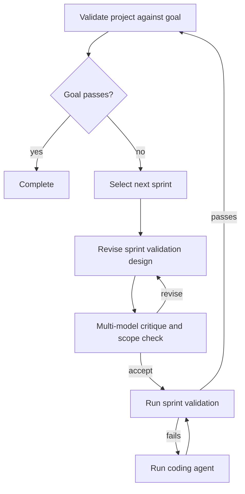

# Should Tractor workflows become Go programs?

**Historical research synthesis. Read [TIE-OFF.md](TIE-OFF.md) first for the current direction.** Later user corrections establish program-specific declarative JSON contracts, comparative evals, selected-call static views and runtime observation as the structural focus. The experiment proposed below is not the current agreed next step; no implementation plan has been approved.

Research date: 2026-09-08. All recommendations below are agent proposals. Tyler has authorized research and collection, not a migration. This report accompanies a [question-specific semantic index](index/README.md), selective pinned upstream source/documentation copies in `corpus/`, researcher memos in `research/`, and a [proposed experiment](research/poc-contract.md). Nothing upstream was built or run as part of this research.

**Subsequent reconsideration:** Tyler challenged the assumption that each project should author a workflow and proposed declarative work descriptions consumed by a small number of Tractor-maintained development routines, with useful Go analysis. [The follow-up](research/established-shapes.md) revises the recommendation around that model. The source findings below remain useful; the original emphasis on arbitrary per-project Go authoring is no longer the preferred starting point.

## Recommendation

Investigate **ordinary Go control flow calling a small Tractor library**, with declarative goals, validation, prompts, and model configuration. Do this through a bounded comparative POC before committing to a migration. The available evidence is enough to justify that experiment and insufficient to justify throwing out the graph implementation today.

The opportunity is substantial because the proposed change moves workflow policy into the language that already expresses it well: functions, nested loops, domain types, and normal conditions. The most valuable improvement is letting an agent return task-specific data while the caller decides how that data affects control flow. A Go API that merely constructs today's node and edge objects would answer only part of the question.

The hard trade is pre-run inspection and enforcement. A graph makes a bounded set of declared routes directly inspectable. Ordinary Go makes local control flow natural but allows important behavior to disappear behind helper calls, dynamic dispatch, concurrency, and arbitrary effects. A useful structural picture is plausible; an exact, complete, domain-level map of unrestricted Go is a much larger promise. Visualization must be part of the POC rather than deferred until after the architectural choice.

## The decisions that should be separated

| Axis | Recommended experiment | What this does not require |
|---|---|---|
| Desired end state | Declare the goal and how it is evaluated | Declaring every control-flow edge |
| Workflow policy | Ordinary Go functions, loops, and conditionals | A new routing expression language |
| Agent result | Concrete caller-selected Go type, validated at the boundary | Agent-selected successor names as the universal result |
| Runtime services | Agent/tool execution, named events, context, cancellation, validation | A new distributed workflow engine |
| Human inspection | Source-linked hierarchical structure before execution; traces during execution | Predicting actual future agent outputs or loop counts |
| Recovery | Inspect current state, revalidate, reuse useful artifacts, continue | Serializing a Go stack or replaying the identical history |

An execution graph, a control-flow graph, a graph authoring language, and an event history are different objects. A program can be represented by graphs without requiring its author to write one. Also, repeated workflow control flow is cyclic; a finite expanded execution or dependency graph may be acyclic. Calling the workflow fundamentally a DAG does not decide the authoring format.

There is also a specific current routing distinction: Tractor's ordinary agent-edge conditions are descriptions offered to the model alongside a closed enum of successor IDs; `choiceSchema` is not executing those descriptions as Go predicates. Code-owned routing would move this decision to a program evaluating domain results. That is an authority and data-contract change as well as an authoring improvement. See the [Tractor source leaf](index/leaves/static-tractor.md).

## Assessing the user's four reasons

### Agent authorability: plausible, not measured yet

Agents have extensive exposure to Go functions, lexical scope, compiler diagnostics, and ordinary refactoring. A nested sprint loop with review and correction maps directly to those constructs. Code also makes it possible to refactor repeated policy into a function instead of cloning nodes and carefully rewiring edges.

But the research does not establish that agents will make fewer mistakes on Tractor tasks. Code can be overabstracted, put effects in surprising places, ignore errors, or spawn uncontrolled concurrency. A slightly verbose graph can be easier to audit than a clever program. Compare the same changes under fresh agent contexts and assess semantic mistakes and repair effort, not just line count or successful compilation.

### Scoping: a real gain, with a remaining policy layer

Go supplies variable scope, argument types, return types, function boundaries, and syntactic validity. Those are good things to stop reimplementing. It also supports ordinary editors, rename tools, and error locations.

However, the compiler does not establish that a validation ran, that a reviewer is independent, that every conceptual outcome was handled, or that a goal is true. In particular, a Go switch over a string or named enum-like value is not automatically exhaustive. A function can return early, a closure can retain mutable outer state, and a goroutine can outlive the logical step that started it.

The goal is to remove checks that reconstruct language structure while retaining checks that enforce Tractor's contract. A source analyzer or runtime guard may still be justified for a specific property; rebuilding today's whole graph linter over Go would undermine the expected simplification.

### Nested loops: the strongest fit

The user's example has three recognizable policies: pursue the overall goal; improve the sprint validation design until critique is satisfied without expanding scope; implement and validate the sprint until it passes. These should be visible as loop boundaries and exit conditions in source.

Naming those functions can be enough abstraction. The first experiment should avoid inventing an elaborate fluent API such as `Loop().Until().Branch().On()` merely to imitate Go's existing constructs. Configuration remains useful for model selection, prompt assets, validation entrypoints, and the declared goal.

The review loop still needs an adjudication policy. Multiple models will disagree, and agreement can be wrong. The program should distinguish proposed findings, decisions to accept/reject them, and authoritative validation. Moving routing into Go makes this policy explicit; it does not solve the underlying judgment problem.

### Recovery: the relaxed requirement materially changes the design

Tractor need not restore the exact instruction pointer to preserve useful work. A startup pass can locate the active goal/sprint, inspect the worktree and durable decisions, run validation, and choose the next useful action. Accepted validation plans and human answers can remain ordinary project artifacts rather than variables trapped in a suspended stack.

This is conceptually close to desired-state reconciliation: derive work from the difference between current and desired state. [Kubernetes controllers](https://kubernetes.io/docs/concepts/architecture/controller/) demonstrate that architecture in another domain. This is an analogy, not a recommendation to import Kubernetes machinery, nor proof that coding agents converge. A code change can invalidate an earlier pass or move the project away from the goal.

The repository alone is not the entire state. An agent process might still be editing it; a human answer may have been stored elsewhere; a PR or deployment may already exist. Recovery should first account for surviving work, preserve decisions that cannot be cheaply re-derived, and query external systems before repeating their effects. For ordinary local edits, inspecting the diff and rerunning validation can be sufficient. For external actions, rediscovery or provider idempotency may matter. None of this requires exact deterministic replay.

This research deliberately does not recommend checkpoints for every value, a provenance subsystem, or an event-sourced model of the repository. Add a saved result only when repeated computation or a particular external effect demonstrates a need.

## Typed results and an embeddable library

**The current source makes this experiment cheaper than a greenfield library project.** Tractor already exports [`HarnessBackend.RunResult`](https://github.com/tylergannon/tractor/blob/07c04ff4c62ff91c625d2e27b6427cd594f67f39/harness/backend.go#L95-L152), which runs a caller-supplied exact-schema turn and returns a generic validated object. `Run` calls it and then decodes the pipeline-specific `Outcome`. The [prompt CLI](https://github.com/tylergannon/tractor/blob/07c04ff4c62ff91c625d2e27b6427cd594f67f39/cmd/tractor/run_prompt.go#L174-L191) already uses the generic path. The `{next, notes}` restriction belongs to the graph agent handler and `AgentBackend.Run` interface, not to every native harness interaction.

The public `engine` package already supports embedding a graph runner; it is inaccurate to say Tractor has no library. The missing ergonomic surface is **graph-independent orchestration using typed domain results**, with convenient operation setup and the relevant lifecycle/validation services. A concrete typed wrapper over `RunResult` is an appropriate starting point. Avoid extracting the entire engine before learning whether that small wrapper answers the real authoring need.

The intended interface should let the caller ask for a `SprintPlan`, a `Review` containing findings, or a `ValidationDesign`, then use those values in ordinary Go. Keep operation metadata—provider, usage, artifacts, errors, cancellation—separate from the domain result. A backend completing successfully, a response decoding successfully, and a goal passing validation are three separate outcomes.

Illustrative API direction only; these are not existing Tractor functions:

```go
type Finding struct {
    Problem string
    Evidence string
    Material bool
}

type Review struct {
    Findings []Finding
}

review, err := tractor.Call[Review](ctx, runtime, request)
if err != nil {
    return err
}
if needsRevision(review.Findings, sprint.Goal) {
    // Ordinary Go decides which work to do next.
}
// Completion still requires the runtime to run the configured validation.
```

Use a package-level generic function in a Go sketch: Go methods cannot introduce their own additional type parameters. The transport may still be JSON with a schema derived from the supported portion of the result type. Decoding into a struct does not establish semantic validity, and provider schema support may differ. Reject unsupported shapes clearly and check domain constraints after decoding. Do not promise arbitrary Go values—functions, channels, or an unrestricted interface graph—as model output.

The existing generic harness requires a JSON object at the schema/result root. A first wrapper can deliberately support concrete struct-shaped results within that existing contract. Supporting primitive or array roots would be a separate extension, not a capability established by `RunResult`.

Embedding has independent value. Another program should be able to run an agent with a typed result and receive progress/cancellation through its own context. It should not have to create fake graph edges to do so. Keeping a YAML adapter over shared services may let existing workflows continue while new policies use Go. Two separate runtimes with diverging validation and event behavior would be a poor migration outcome.

There is a genuine authority trade: a caller controlling arbitrary Go can simply skip an API or return early. For Tractor-managed runs, the top-level completion operation should run the declared validator before recording success; typed model output must not be a way around that. An embeddable library cannot make every arbitrary host application obey its policy. Define which guarantees apply to the managed runner and which responsibilities belong to an embedding caller.

## Visualization: choose an honest promise

There are three different human needs:

1. Understand the loop structure, exit conditions, named work, and validation boundaries.
2. Inspect a complete abstract set of possible routes and prove properties over it.
3. Edit a diagram and save it back into the executable definition.

The first is a promising match for code. The second needs stronger conventions or analysis. The third strongly favors a constrained representation or generated code with a clearly limited editable region. Tyler has not selected among these needs; this recommendation assumes the first is principal and would need reevaluation if complete topology or visual editing is essential.

A structural viewer could read Go syntax/type information, show functions and nested `for`/`if`/`switch` blocks, recognize named Tractor operations, and link every visible element to source. Calls it cannot resolve should remain labeled opaque operations. Large helpers should be collapsible. This is a proposed product, not something found ready-made in the surveyed systems.

It is possible to draw both sides of a branch before knowing the agent's answer. Unknown outcomes do not themselves make a source diagram impossible; today's graph also cannot know the chosen outcome. The harder problems are finding domain-level operations behind arbitrary calls and knowing whether a displayed abstraction is complete. Dynamic fan-out can be shown as “for each selected task” rather than fabricating concrete future task instances.

[Go's CFG implementation](https://github.com/golang/tools/blob/2af88d6fb782ffc8a0f607598345de595cd60c27/go/cfg/cfg.go) supplies useful infrastructure but is not a finished workflow viewer: it models individual-function basic blocks and omits some semantic detail. An AST-based outline may be more readable than a raw basic-block graph.

[Prefect's visualization guide](https://github.com/PrefectHQ/prefect/blob/34ee7056b2b83cb0eaaa80378c5202d6c0b5eeef/docs/v3/how-to-guides/workflows/visualize-workflow-structure.mdx) provides a useful caution: visualization executes code outside tasks, and dynamic paths can require mocked task results. That produces a scenario, not an exhaustive static picture. A Tractor preview should not quietly make real agent/tool calls to discover its shape.

Do not start with a second manually maintained diagram of the complete workflow. It creates exactly the synchronization obligation that a better authoring model should remove. A small declarative goal/validation summary is reasonable because it describes a different concern; duplicated edges and conditions are not.

For this specific example, the proposed viewer should be capable of showing something like the following. This is an illustrative target drawn from the user's pseudocode, not output from an implemented extractor. Error/cancellation paths are omitted here but would need a visible treatment in the actual viewer.



## Why retaining the graph could still win

Against Tractor's [five arts](corpus/static/tractor/docs/five-arts.md), the expected trade is:

| Art | Potential gain from Go | What must be preserved or paid for |
|---|---|---|
| Ensure the work is actually done | Explicit policy over typed findings and validation results | Managed completion must still run authoritative validation; compiler success is not goal success |
| Split work into manageable pieces | Reusable functions for planning, critique, coding, and validation | Function abstraction must not hide what context/evidence each agent receives |
| Help humans define and author work | Natural nested structure and ordinary code tools | Non-Go authors, distribution, and visual-editing round trips may become harder |
| Show how work is going | Named spans nested like the program's loops | Preserve iteration identity, current goal/item, events, and source links; a bare SDK call log is insufficient |
| Let observers steer work | Configuration and agent steering can remain runtime services | Cancellation, attention gates, and active-turn steering must cross the library boundary; compiled code does not automatically become editable in flight |

This is principally a proposed improvement to authoring and decomposition, with a possible cost to static inspection and centralized enforcement. It is not a uniform improvement across all five arts.

- **Inspectable policy:** known nodes and declared edges make some reachability, loop-boundary, and route checks straightforward before spending tokens. Ordinary code loses that convenience.
- **Visual editing:** graph-source round trips are tractable when the definition is itself a graph. Arbitrary source-to-diagram-to-source transformations are a separate hard product.
- **Packaging:** a workflow file needs no Go compiler/module setup. Go authoring introduces toolchain and dependency-version work, especially for non-Go projects and distribution of untrusted workflow programs.
- **Uniform behavior:** a central interpreter gives every operation the same event, cancellation, steering, retry, and validation conventions. A library only sees operations that use its boundaries.
- **Existing investment:** Tractor already has working graph workflows. A migration needs behavioral benefit large enough to repay extraction, compatibility, documentation, and regression costs.

These are reasons to keep the graph as the control and compatibility surface during a POC. They are not reasons to assume that graph authoring remains the best way to express nested policy.

## Choosing among implementation approaches

| Approach | Benefit | Main cost | Judgment |
|---|---|---|---|
| Keep YAML | Existing execution, static graph, distribution | Routing/scoping/type friction remains | Credible fallback and control |
| Go graph builder | Compiler checks builder use; preserves pre-run graph | Still authors edges; Go branches construct the graph rather than route future agent results | Useful only if this narrower benefit is sufficient |
| Ordinary Go + Tractor library | Natural nesting, typed values, reusable policy and embedding | Structural visibility and managed-runtime guarantees must be designed | Recommended POC |
| Restricted-Go-to-graph compiler | Potentially preserves a strong graph contract | New language subset, compiler, diagnostics, unsupported construct rules | Reject as the starting approach |
| Adopt Temporal/Restate/DBOS | Established durable execution mechanisms | Runtime restrictions and infrastructure for a low-priority requirement | Reconsider only when an actual durability need appears |

One researcher preferred a Go graph builder to preserve pre-run topology and reuse all current lint. That is a defensible counterproposal **if a complete declared graph is required**. I would not choose it as the first experiment for this request: a builder evaluates Go conditions while constructing the graph, whereas the user's main interest is Go making decisions from future agent results during execution. It risks preserving the very policy-expression problem under a nicer syntax. The source-linked structural preview experiment tests whether the stronger static contract is actually necessary.

## The experiment that should decide it

The [POC contract](research/poc-contract.md) specifies matched editing tasks and named behavioral demonstrations. Start with one real nested sprint workflow and a second caller in another Go module. Demonstrate custom result types, visible routing policy, pre-run human comprehension, real failed-then-passed validation, cancellation, and useful restart after interruption.

Measure the authoring claim rather than assuming it: semantic defects, repair turns, and human comprehension matter more than fewer lines. A tiny matched sample can guide a decision but is not a statistical performance study.

Proceed if the program clearly improves the workflow edits, typed domain results remove routing glue, the human can understand its static view, and a modest library extraction retains the guarantees that matter. Keep YAML primary if the gain is mostly cosmetic or the preview/enforcement work recreates an elaborate second language. Preserve the existing representation until that experiment has earned a migration.

No runtime proof is claimed by this research. A future new Tractor build still requires the repository's canonical real-agent integration proof in addition to proof of the changed behavior.

## Evidence inventory

| Project and inspected surface | Current-status evidence collected on 2026-09-08 | Decision-relevant result |
|---|---|---|
| [VirtusLab Orca](index/leaves/imperative-orca.md), Scala agent workflows | Non-archived; [v0.1.6](https://github.com/VirtusLab/orca/releases/tag/v0.1.6), Aug 28 | Closest direct precedent: normal code plus typed agent replies. Its Git-coupled checkpoint system is additional machinery, not the source of imperative expressiveness. Early application, not evidence of a mature embeddable Go runtime. |
| [Genkit Go](index/leaves/imperative-genkit-go.md) | Non-archived; [go/v1.13.1](https://github.com/genkit-ai/genkit/releases/tag/go%2Fv1.13.1), Sep 3 | Ordinary typed function flows and named runtime steps. Strong API-shape precedent; no pre-run Go workflow extractor established. |
| [Pydantic Graph](index/leaves/imperative-pydantic-graph.md) | Non-archived; [v2.41.0](https://github.com/pydantic/pydantic-ai/releases/tag/v2.41.0), Sep 8 | Typed code and visualization coexist because graph topology is materialized. Distinct from general Pydantic AI usage; Python comparison, not a Go dependency. |
| [Google ADK Go](index/leaves/imperative-adk-go.md) | Non-archived; [v2.3.0](https://github.com/google/adk-go/releases/tag/v2.3.0), Aug 31 | Configured loop agents and DOT for known agent composition. Inspected output-state path still has a schema-validation/unmarshal TODO, so an OutputSchema field alone does not prove a typed result boundary. |
| [Temporal Go](index/leaves/durable-temporal-go.md) | Non-archived; [v1.48.0](https://github.com/temporalio/sdk-go/releases/tag/v1.48.0), Aug 18 | Ordinary-looking control flow with deterministic command replay, activities, and code-version constraints. Valuable mechanism reference; its durability requirements exceed this request. |
| [Restate Go](index/leaves/durable-restate-go.md) | Non-archived; [v1.0.4](https://github.com/restatedev/sdk-go/releases/tag/v1.0.4), Aug 21 | Normal handler logic around journaled context operations. Introduces a server and durable-operation constraints. |
| [DBOS Go](index/leaves/durable-dbos-go.md) | Non-archived; [v1.3.0](https://github.com/dbos-inc/dbos-transact-golang/releases/tag/v1.3.0), Sep 2 | A real Go implementation. PostgreSQL-backed steps explicitly have an at-least-once effect boundary; atomic transactions offer a narrower stronger guarantee. |
| [Prefect visualization](index/leaves/durable-prefect-visualization.md) | Non-archived; [3.8.5](https://github.com/PrefectHQ/prefect/releases/tag/3.8.5), Sep 3 | A documented code-visualization approach that runs non-task code and uses mocked results for dynamic scenarios. Useful caution, not a static-analysis solution. |
| [Dagger Go](index/leaves/static-dagger.md) | Non-archived repository; pinned `d8811256`; recent activity observed Sep 8 | Go SDK builds a lazy dependency/query graph. Evidence for a typed builder and embeddable client, not a static picture of every host-language route. |
| [LangGraph Functional API](index/leaves/static-langgraph.md) | Non-archived Python/JS repositories; implementation pin `81bf17b2`, docs pin `bbbdb5aa`; recent activity observed Sep 6–8 | Ordinary functions/tasks are supported; the inspected official Functional API documentation explicitly declines graph visualization. Distinguish this from the Graph API's renderer. |

Current Tractor is also already partway toward state-based recovery: [`rebuildLoopFrames`](https://github.com/tylergannon/tractor/blob/07c04ff4c62ff91c625d2e27b6427cd594f67f39/engine/runner.go#L630-L675) reconstructs frames from ledgers and may rewind to the innermost enclosing loop. This weakens any claim that abandoning graph authoring is necessary to abandon exact continuation. Authoring, response typing, and recovery improvements can be tested independently.

See the semantic index and source leaves for pinned mechanisms, repository status snapshots, licenses, and explicit unknowns. An active repository and published version establish current availability, not production adoption or proof that the system will meet Tractor's needs. No comparative agent-authoring benchmark or generated-Go visualization was performed here.
