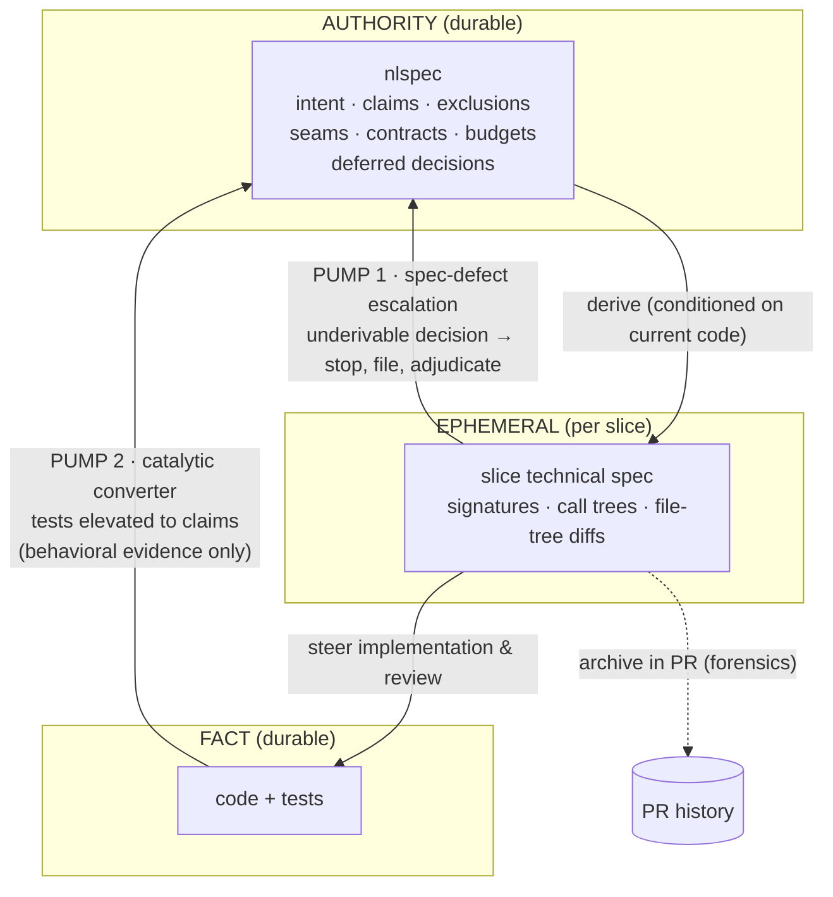
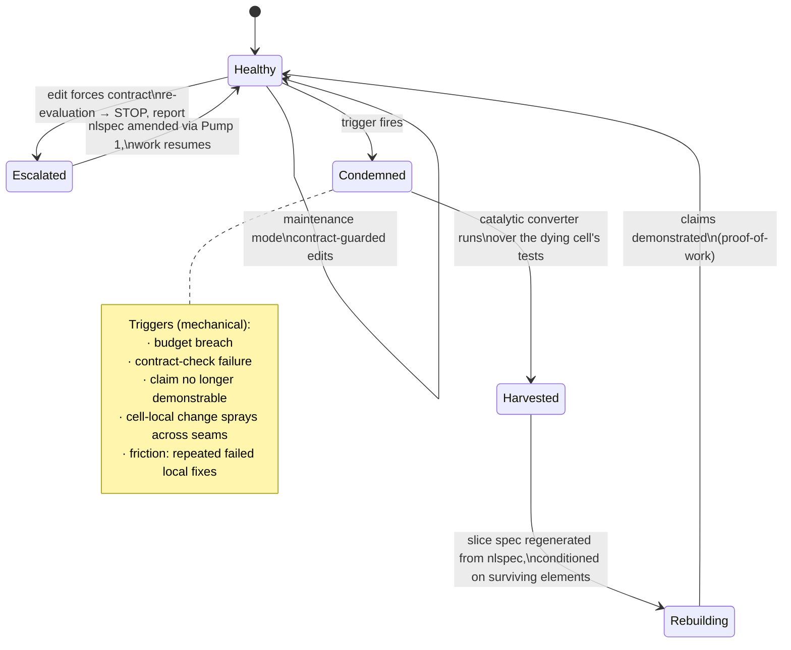
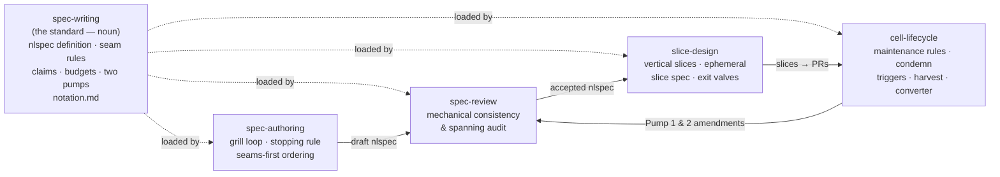

# The nlspec Methodology

A methodology for a frontier model managing weaker models in the production of
maintainable software, governed by a single authoritative natural-language
specification. This document coalesces the reasoning developed in session on
2026-07-28; the decision log is in [journal.md](journal.md).

**Operating assumption, stated once and relied on throughout:** the executor of
this methodology — the author of specs, the designer of slices, the adjudicator
of escalations — is a frontier model (or a human working with one). Nothing
here attempts to generalize software engineering so that weak models can manage
large projects. Weak models *implement*; the methodology exists so that a
frontier model can steer them cheaply and mechanically.

---

## 1. The constraint this methodology answers

Coding models are trained by reinforcement learning against fast verifiers:
did the tests pass, did nothing else break. Maintainability has no fast
oracle — the cost function of bad architecture pays out over weeks to years —
so it is absent from the reward signal. Consequences (argued at length in
humanlayer's *Why Software Factories Fail*):

- Models solve one-off problems brilliantly and degrade codebase structure
  over time.
- Review agents and more tokens raise the *floor* (catch dumb mistakes) but
  cannot move the *ceiling*: if a model could reliably tell good code from
  bad, it would have written the good version to begin with.
- Every "lights-off" factory eventually meets a problem the agents can't
  solve, in a codebase no human has read for months.

wsff's answer is to put the human back in the loop — plan up front, slice
vertically, *read the dang code*, resteer every 100–200 lines. That is correct
for human-steered teams and wrong for us: it makes human review bandwidth the
unit of control, a bottleneck this methodology deliberately does not have.

### The substitution

We cannot check maintainability. We can check **seam integrity**:

1. Does each cell's actual public surface match its stated contract?
2. Does anything outside a cell reach past the contract into its internals?
3. Is each cell under its code-volume budget?
4. Are the claims routed through each cell actually demonstrated?

Four checks — all mechanical, all cheap, all runnable by a weak agent. Together
they stand in for a surprising fraction of what "maintainable" means:
*shotgun surgery*, the canonical maintainability failure, is precisely a seam
failure — a concept that should live in one cell leaked into eleven. We do not
concede quality; we attack the same failure through a channel that has a
verifier.

What the substitution deliberately does **not** catch: internal degradation
that breaches no contract, fails no claim, and stays under budget. That is the
fungibility premise stated honestly — such degradation is defined as
not-a-problem until it trips a wire, and the budget cap bounds how expensive
the eventual repair can get. If a property matters (say, algorithmic
complexity), it should have been a measurable claim.

---

## 2. Core objects

### The nlspec

A **minimally spanning** natural-language specification. The term is borrowed
from basis vectors, and the metaphor is load-bearing: the spec is a basis from
which the whole space — the software — is constructible, given the materials
plus the rules of engagement.

- **Spanning**: every question a competent implementer could not settle for
  themselves is answered.
- **Minimal**: *only* those questions are answered. Anything a capable reader
  can derive in context is elided.

**Membership test** (what belongs in the nlspec): a decision belongs iff it is
*not derivable* from what is already there plus the rules of engagement.
Practical detector: two capable readers would derive different answers, **and**
the difference matters at a seam, claim, budget, or exclusion. If they'd differ
only in cell internals, it is span — leave it out.

Required contents:

| Section | Holds |
|---|---|
| Overview & goals | intent, needs served, design principles |
| Definition of done | behavioral **claims**, each classified cell-local or integration |
| Exclusions | what is deliberately not built |
| Central types & algorithms | in neutral pseudocode (see the notation standard) |
| Seams & contracts | the cell decomposition; each cell's responsibility, boundary, contract, **budget** |
| Deferred decisions | consciously unanswered questions (tripwire list) |

### Cells, seams, contracts, budgets

The seams partition the codebase into **cells**. Each cell has an explicit
contract; everything inside is **fungible** — assuming the contract holds and
the claims are demonstrated, any implementation is acceptable.

- **Seam-quality criterion (the Parnas test):** a seam belongs where the
  *reason to change* differs on either side. What changes together lives
  together. This is the one piece of quality theory imported wholesale,
  because it is agent-legible: "would these two things change for the same
  reason?" is answerable from the spec.
- **Budget:** each cell carries a maximum code volume. The budget is a
  **tripwire, not an implementer rule** — on breach the implementer stops and
  reports; the spec decides where the split goes. Decomposition authority
  never leaves the spec. Keep budgets slightly tight on purpose (§5).

### Claims

Definition-of-done claims are the spec's contact with reality — they are what
`proof-of-work` demonstrates. Each is classified:

- **cell-local** — provable by exercising one cell through its contract;
- **integration** — provable only end-to-end.

The classification is also a diagnostic: if most claims are integration-only,
the decomposition bought nothing.

---

## 3. The artifact hierarchy and the lifetime rule

The system has exactly **two durable authorities** — the nlspec (intent) and
the code (fact) — plus one deliberately ephemeral layer between them:

| Artifact | Role | Lifetime |
|---|---|---|
| **nlspec** | intent, claims, exclusions, seams, budgets, deferred decisions | permanent, maintained, **sole authority** |
| **per-slice technical spec** | derivable mechanics for one slice: concrete types, signatures, call-stack trees, file-tree diffs, algorithms | authoritative for one slice, then **archived in the PR** as forensics — never maintained |
| **code + tests** | fact; tests double as candidate claims awaiting elevation | permanent; only full-fidelity record of internals |

**Routing test for any piece of content:** *how long must someone agree with
this?* Forever-and-binding → nlspec. This slice → slice spec. It's in the
code → don't write it down at all.

**The lifetime rule** makes discarding safe by construction: the slice spec
may only contain decisions whose lifetime ≤ the slice. Any decision a future
slice must agree with is, by that property, seam-level — and must be promoted
into the nlspec *before the slice ships*.

### Why the middle layer must be ephemeral

Adjudicated via adversarial debate; the full arguments are in the session
record. The decisive points:

1. **Maintenance economics.** A program-design doc is 30–60% of the code's own
   information content, with no compiler, tests, or runtime to catch drift.
   Keeping it synchronized is negative-value work — the code already states
   those facts with perfect fidelity.
2. **Stale detail is active misinformation.** Humans discount old docs
   socially; for an LLM a confident document in the repo *is evidence*. Weak
   models will "fix" correct code back toward a dead spec. A wrong signpost is
   strictly worse than none.
3. **Durability is authority.** Whatever the manifesto says, a durably
   documented internal will be conformed to, diffed against, and defended in
   review — hoisting cell internals above the authority line and defeating
   both fungibility and the budget mechanism.
4. **Three authorities, no resolution rule.** nlspec/code conflicts resolve
   along one edge. Insert a durable mid-level doc and every discrepancy has
   three pairwise edges, audited by a model that will sometimes resolve the
   triangle confidently in the wrong direction.
5. **Regeneration tests the spec.** Deriving the slice design fresh from the
   nlspec each slice continuously probes its spanning: unstable derivations
   that matter reveal a missing contract, and the fix lands in the artifact
   whose job is to hold it.

The durable side's objections (lost rationale, nondeterministic regeneration,
lost approval record, no drift baseline) are all answered — but by the
operating model of §5, not by escape valves. Archived-in-PR preserves the
approval record and the forensic baseline without maintenance. The rest
dissolve once two mistaken assumptions are named: that regeneration happens
per edit, and that drift must be *detected* rather than *triggered* (§5).

---

## 4. Spanning over time: the stopping rule and the two pumps

**Spanning is a property the nlspec maintains over its lifetime, not one it
achieves at authoring.** Nobody enumerates the dimensions of a space up front;
a missing dimension is discovered the moment construction encounters a vector
it cannot express. "Answer all hard questions up front" is a named pitfall —
a giant productivity sink that the basis metaphor itself argues against.

**Stopping rule (authoring):** keep answering questions only while the answers
land in the nlspec's own sections. If the next answer could change a seam,
claim, budget, or exclusion — answer before stopping. If it would only ever
change cell internals — stop; answering is speculation. Operationally:
authoring ends after **two consecutive grill rounds that surface only
derivable material**. Questions never run out; seam-moving answers do.

The cost asymmetry justifies stopping early: a hard question answered up front
is answered by speculation; the same question answered when a slice hits it is
answered with the construction attempt in hand — better informed, and paid for
only if it arises. Most deferred questions never do.

**Deferred-decisions section:** questions consciously left unanswered are
listed in the nlspec. Not a dumping ground — a tripwire list. It converts an
*unknown* spanning failure (weak model silently improvises; discovered at
integration) into a *known* one (weak model hits a flagged question and
escalates immediately).

**The two pumps.** The nlspec has exactly two intake channels; nothing else
writes to it. Authority flows only downward; content flows only upward.

- **Pump 1 — spec-defect escalation** (cargo: decisions). Implementers never
  amend the nlspec. On hitting an underivable decision: stop, file a spec
  defect, frontier model + HITL adjudicate, answer lands in the nlspec, work
  resumes. Designed as a discipline rule; it *is* the spanning-repair channel.
- **Pump 2 — the catalytic converter** (cargo: behavioral evidence). Test
  cases discovered in code are evaluated for elevation into claims, up to
  inclusion in the nlspec. A promoted test is *checkable memory* — it encodes
  what a hard-won decision protected without freezing how it was implemented.
  Intake is behavioral evidence **only**: the moment the converter accepts
  opinions or "permanent lessons," it is a third authority again.

This pair replaces ADR-style decision records, which were considered and
dropped: rationale prose is unverifiable and slowly lies — exactly the artifact
class the methodology exists to eliminate.

---

## 5. The cell lifecycle: two modes, replace economics

The durable-spec worldview is a **detect-and-repair** worldview: documents
exist to be diffed against, drift must be *found*. This methodology runs on
**replace economics**: cells are budget-bounded precisely so they are cheap to
rebuild wholesale from their contract. Under replace economics you need no
drift baseline — only drift **triggers**.

**Maintenance mode** (the common case): ordinary contract-guarded agent work.
"Fix this bug; do not touch the contract; if the fix forces a contract
re-evaluation, stop and report." No spec is generated, nothing regenerated, no
gap analysis. The nlspec is a guardrail here, not a build input.

**Rebuild mode** (rare, deliberate): the cell is **condemned** and rebuilt
from its contract. Regeneration is never a fresh stochastic sample — it is
conditioned on the surviving implementation and everything the converter has
promoted. The variance objection applies only to a workflow nobody runs.

**Harvest first — the order is fixed.** A condemned cell's tests are the only
record of everything its ephemeral slice specs never wrote down. Run the
converter before condemning; elevate what encodes real intent; then rebuild
and demonstrate claims.

**The budget is the primary drift tripwire**, not merely an anti-bloat rule.
Compounding internal degradation shows up as *volume first* — duplication,
defensive scaffolding, flag soup. So: check budgets mechanically on every
slice, and keep them slightly tight on purpose. You want the wire to trip
while the rebuild is still cheap.

The residual bite — drift invisible to every trigger, during the window before
it grows visible — is the bullet §1 already bites openly.

---

## 6. Slices

Work is delivered in **vertical slices** (wsff's strongest practical import).
Models default to horizontal, stack-order plans — migrations, services, API,
frontend — under which nothing is touchable until the end. Slice design
inverts this: each slice crosses the stack thinly and produces something
exercisable (curl-able, browsable, claim-demonstrable) early.

Each slice gets an ephemeral technical spec derived from nlspec + current
code, using the artifacts that earn their keep:

- **call-stack trees** (diff syntax when the interesting part is the change),
- **file-tree diffs** (the concrete projection of the seam model onto disk —
  turns "is this cell too big" and "is this change about to spray" into
  countable questions before code exists),
- **types and signatures** for the key new functions,
- the list of **existing functions/types to modify**.

Slice exit checks (the three valves):

1. anything with cross-slice lifetime promoted to the nlspec (lifetime rule);
2. candidate tests run through the converter;
3. the slice spec archived in the PR; budgets of touched cells verified.

The implementer handoff contract rides with every slice: contracts are
inviolable; underivable decisions and flagged deferred decisions escalate
immediately; budget breach stops work.

---

## 7. The skill suite

Split on the **noun/verbs axis** — one standard that carries the vocabulary,
verb skills that stay short because they don't restate it. (The alternative —
mirroring wsff's four phases — reproduces someone else's process and yields
four documents where one artifact plus operations on it is wanted.)

| Skill | Kind | Owns |
|---|---|---|
| `spec-writing` | noun (standard) | what an nlspec *is*: definition, membership test, required contents, seam rules, claim taxonomy, budgets, artifact hierarchy, the two pumps; notation in `notation.md` |
| `spec-authoring` | verb | producing a new nlspec: grill loop, goals → seams → contracts ordering, stopping rule, deferred-decisions capture |
| `spec-review` | verb | the mechanical pass: claim traceability both directions, seam audit, derivability spot-checks, contradiction hunt |
| `slice-design` | verb | nlspec + code → ephemeral slice spec; vertical slicing; budget checks; the three exit valves; implementer handoff contract |
| `cell-lifecycle` | verb | maintenance-mode rules, condemn triggers, harvest-first rebuild protocol, catalytic converter |

Existing skills this suite composes with rather than duplicates:
`/grilling` (the authoring interview), `/proof-of-work` (claims are proof
claims), `/request-adversarial-review` + `/consensus` (material spec reviews),
`/write-prompts` (style governance for the skills themselves).

---

## 8. Open questions

Carried in the journal; the notable ones:

- Concrete budget metric (raw LOC vs. weighted) and defaults — likely
  per-project in the nlspec itself, with the standard only mandating that a
  number exist and be mechanically checkable.
- Slice-spec archival mechanics (PR body vs. proof-uploader artifact).
- Whether spec-review always launches an adversarial review or only for
  material specs.
- Whether cell-lifecycle eventually splits (converter vs. condemnation as
  separate verbs) — deferred until usage shows the seam.
