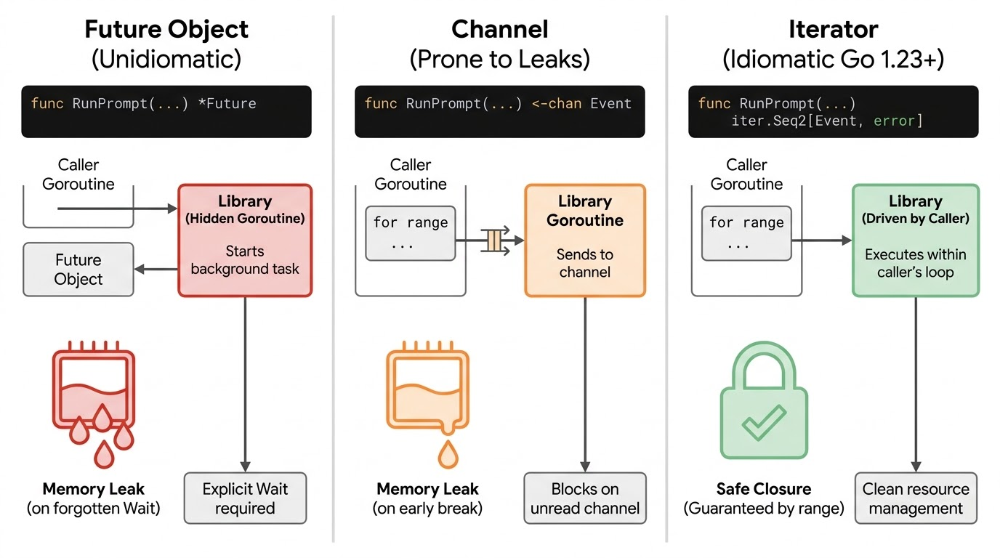
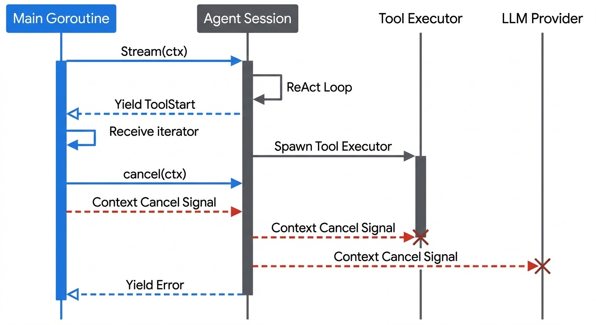

> Gemini Deep Research, exported from https://share.gemini.google/1MABsrkfjta7 (https://gemini.google.com/share/e4226bf00f51) on 2026-09-10. `[cite: N]` markers refer to the Sources list at the end.

# Advanced Go Agent Orchestration: API Design, Primitives, and Ecosystem Analysis

The emergence of autonomous artificial intelligence agents necessitates robust orchestration frameworks capable of managing long-running, I/O-bound, and highly concurrent workloads. Within this paradigm, the Go programming language has emerged as a premier runtime environment. Its lightweight goroutines, native context cancellation via `context.Context`, and single-binary compilation model align perfectly with the operational requirements of production-grade agentic systems, offering a distinct operational advantage over interpreter-bound languages like Python or single-threaded environments like Node.js [cite: 1, 2]. However, translating agentic workflows—which are inherently non-deterministic, stateful, and iterative—into idiomatic Go APIs presents a unique set of architectural challenges. The design space spans from heavyweight, graph-based orchestration engines to minimalist, single-loop execution libraries. 

This comprehensive research report conducts an exhaustive analysis of the Go agent ecosystem, coalescing design patterns from prominent and adjacent projects. By evaluating the theoretical foundations of agent harnesses, analyzing competing framework architectures, and dissecting the mechanics of asynchronous Go primitives, this document prescribes an idiomatic API architecture for driving autonomous agents. It directly addresses critical design considerations, including the handling of asynchronous return types, the structuring of stateful sessions versus task spawners, the integration of structured JSON outputs, the modeling of higher-level topological loops, and the nuanced trade-offs between utilizing standardized control protocols versus maintaining access to provider-specific frontier capabilities.

## The Theoretical Foundation of Agent Harnesses

Before defining the concrete API boundaries of a Go orchestration library, it is essential to establish the theoretical purpose of the software being built. In contemporary AI architecture, the large language model (LLM) itself is increasingly viewed merely as a parametric reasoning engine containing frozen knowledge and probabilistic logic. The true capability of an agent emerges not solely from the model's weights, but from the runtime environment surrounding it. Recent academic consensus formalizes this paradigm through the lens of "externalization," positing that agent infrastructure matters because it transforms hard cognitive burdens into forms that the model can solve more reliably [cite: 3, 4].

Under the externalization framework, the orchestration library acts as the "harness." Capabilities that earlier systems expected the model to recover internally are now externalized into distinct operational layers [cite: 4]. Memory mechanisms externalize state across time, removing the burden of infinite recall from the model and converting it into a recognition and retrieval task. Reusable skills externalize procedural expertise, preventing the model from having to invent operational workflows from scratch during every execution. Interaction protocols externalize the structure of environmental engagement, ensuring that tool calls adhere to rigid schemas. The Go library being designed is, therefore, the unification layer that coordinates these externalized components into governed, verifiable execution [cite: 3, 4]. 

By viewing the orchestration library as a cognitive artifact that restructures the agent's environment, the API design constraints become clear. The library must not obscure the model's reasoning process, but rather provide a rigid, type-safe, and highly observable structure for the model to interact with its externalized memory and skills. A successful Go harness will manage the temporal complexities of the agent's existence—context window limitations, execution interruptions, and network failures—while allowing the parametric model to focus entirely on interpretative reasoning [cite: 5, 6].

## Architectural Review of the Go Agent Ecosystem

The current landscape of Go agent orchestration is characterized by a bifurcation in design philosophy. On one end of the spectrum reside comprehensive, graph-based frameworks that port concepts from dense Python ecosystems, attempting to provide a unified solution for every aspect of AI engineering. On the other end are minimalist, Go-native libraries that explicitly bound their scope to the single-agent execution loop, leaving higher-level orchestration to the application layer.

| Framework / Project | Architectural Paradigm | Core Features and Primitives | Target Use Case |
| :--- | :--- | :--- | :--- |
| **LangChainGo** [cite: 1, 7] | Unified Wrapper & Chain Composition | Ports the Python LangChain architecture to Go. Features Model I/O wrappers, standardized vector store interfaces, structural chains, and tool-based sub-agent orchestration. | Rapid prototyping and porting of existing Python-based LLM architectures into Go binaries. |
| **Eino** (CloudWeGo) [cite: 8, 9, 10] | Directed Acyclic Graph (DAG) & Workflow | Production-grade ADK (Agent Development Kit). Features polymorphic `AgenticMessage` structures, automatic stream concatenation/boxing, callback aspects, and interrupt/resume hooks. | Enterprise-scale, highly concurrent applications requiring deep observability and complex routing topologies. |
| **AgentMesh** [cite: 11] | Bulk-Synchronous Parallel (BSP) Graph | Pregel-style execution model. Features lock-free channel-based state management, copy-on-write checkpointing, intelligent model routing, and built-in human-in-the-loop approval guards. | Distributed, multi-agent collaboration environments requiring high-throughput state access and resilience. |
| **Graft** [cite: 12] | Interface-Driven & Zero-Vendor SDK | Prioritizes minimal transitive dependencies. Features generic tools derived from Go structs, native MCP integration, automatic agent handoffs, and input/output guardrails. | Lightweight deployments where strict type safety and minimal binary bloat are paramount. |
| **pi-agent-go** [cite: 2, 13, 14] | Minimalist Single-Loop Execution | Intentionally stops where the agent loop stops. Features Go 1.23 `iter.Seq2` streaming, typed tools, parallel tool execution, mid-run steering channels, and immutable state snapshotting. | Systems where developers want to maintain explicit control over higher-level application orchestration. |
| **Beluga-AI** [cite: 15, 16] | Generic Pluggable Reasoning | Enforces Go 1.23+ idioms. Features `iter.Seq2` for all public streaming APIs, code-as-action sandboxing, multi-agent orchestration patterns (Supervisor, Handoff), and zero use of `interface{}` in public boundaries. | Modern Go environments demanding strict type safety, zero goroutine leaks, and pluggable planner algorithms (ReAct, LATS, ToT). |

### Heavyweight Graph and Workflow Frameworks
Projects such as LangChainGo and Eino represent the maximalist approach to agent orchestration. LangChainGo provides a unified, typed interface abstracting disparate AI technologies, heavily utilizing composable chains and standardizing vector store integrations [cite: 1]. This allows developers to swap out underlying models or databases without rewriting business logic [cite: 1]. However, its architecture closely mirrors Python's object-oriented inheritance models, which can occasionally conflict with Go's preference for lightweight interface composition and explicit error handling.

Eino, developed by ByteDance's CloudWeGo team, represents a highly mature, production-tested alternative designed specifically for Go concurrency. It utilizes an Agent Development Kit (ADK) that models orchestration as Directed Graphs and Workflows, providing specific agent implementations like Loop, Parallel, and Sequential patterns [cite: 8, 17]. Eino excels in stream processing; it automatically handles the concatenating, boxing, merging, and copying of data streams as they flow between execution nodes, abstracting away the complexity of managing chunked HTTP responses [cite: 8, 10]. Eino recently introduced the `AgenticMessage`, a polymorphic structure capable of natively carrying complex composite content, including intermediate reasoning processes, multimodal data, and tool execution results [cite: 9].

AgentMesh introduces another distinct paradigm: production-grade multi-agent orchestration powered by Pregel-style bulk-synchronous parallel (BSP) graph processing [cite: 11]. This mathematical approach optimizes concurrent state access, allowing for highly complex, parallel execution of agent nodes [cite: 11]. AgentMesh utilizes lock-free, channel-based state management with zero-copy resume capabilities, ensuring that large conversational contexts do not trigger aggressive garbage collection spikes during checkpoint restoration [cite: 11].

### Minimalist Single-Loop Libraries
Conversely, projects such as `pi-agent-go` and `Graft` prioritize Go-idiomatic simplicity, intentionally halting their abstractions where the core autonomous loop ends [cite: 12, 13]. The philosophy underlying `pi-agent-go` asserts that multi-agent orchestration, session persistence, and complex context compaction are fundamentally application-layer concerns that should not be obscured by an orchestration framework [cite: 13]. Instead of routing graphs, it provides a strictly bounded single-loop agent that ingests an input, optionally executes parallel tool calls, returns a text response, and repeats this cycle until termination [cite: 13].

Graft similarly avoids massive vendor SDK dependencies, interacting directly with underlying APIs via raw `net/http` to maintain a zero-dependency posture [cite: 12]. It provides interface-driven, generic tools derived directly from Go structs, and handles agent handoffs and guardrail validation natively without forcing the developer into a proprietary workflow syntax [cite: 12]. These minimalist libraries trade the expansive feature sets of Eino or LangChainGo for explicit control flow, heavily relying on standard Go primitives like generic types, context cancellation, and iteration.

## Idiomatic API Design: Return Types and Asynchronous Execution

The core mechanism of any agent orchestration library is how it handles the invocation, lifecycle, and return values of an agentic prompt. The user query explicitly questions the architectural validity of returning `Future` objects, channels, or utilizing a blocking `Wait()` mechanism when executing a prompt session. Resolving this requires a deep alignment with Go's concurrency philosophy.

### The Anti-Pattern of Futures in Local Go Execution
In distributed systems or durable workflow engines such as Temporal, DBOS, Hatchet, or Dapr, the concept of a `Future` or `Promise` is absolutely essential [cite: 18, 19, 20]. These engines require a representation of a value that will eventually resolve across network boundaries, or a state that must be maintained after a process crash and subsequent rehydration [cite: 21, 22]. In a Temporal workflow, for instance, asynchronous activities return Futures that the orchestration engine tracks, automatically handling exponential backoff and replay logistics [cite: 20, 22].

However, introducing a `Future` object into a localized, in-memory Go orchestration library is a severe anti-pattern. Go's concurrency model operates on a foundational premise: asynchronous execution should be managed by the caller, not obscured by the callee. A well-designed, idiomatic Go library provides synchronous, blocking functions. If the library consumer wishes to avoid blocking their main execution thread, they trivially wrap the library call in a goroutine (e.g., `go session.RunPrompt(ctx, "Analyze data")`) [cite: 2]. Introducing a `Future` forces the library to spawn and manage goroutine lifecycles internally, obscuring the execution cost from the developer and vastly complicating the propagation of cancellation via `context.Context`.

### The Lifecycle Risks of Channel-Based Public APIs
Historically, returning a read-only channel (e.g., `<-chan Event`) for streaming agent responses has been a common pattern in early AI libraries. While channels are exceptional synchronization primitives, they constitute poor streaming APIs at package boundaries [cite: 15]. The primary risk is the silent creation of goroutine leaks. 

If a consumer ranges over a returned channel but decides to terminate the loop early—perhaps because the LLM generated the specific piece of data they required in the first few tokens, or because a heuristic guardrail triggered a `break` statement—the internal library goroutine feeding that channel will block indefinitely attempting to send the next token [cite: 15]. Unless the library implements intricate, error-prone `select` statements monitoring an explicit cancellation channel alongside every single `chan <-` send operation, the memory leak is guaranteed [cite: 15, 23].

### The Modern Standard: `iter.Seq2` and Controlled Streaming
The definitive, modern Go idiom for representing a continuous stream of events—such as the step-by-step execution of a ReAct agent or a stream of generative tokens—is the Go 1.23 iterator pattern, specifically `iter.Seq2[Event, error]` [cite: 15, 24].

As implemented in leading-edge, strict-idiom libraries like `pi-llm-go`, `pi-agent-go`, and `Beluga-AI`, returning `iter.Seq2` completely delegates iteration control to the consumer's `for ... range` loop [cite: 13, 15, 16]. The `iter.Seq2[A, B]` type is fundamentally a function signature: `func(yield func(A, B) bool)`. The producer (the orchestration library) calls `yield` for each event generated by the LLM. The consumer drives the iteration. Crucially, when the consumer returns from their loop—either normally or via an early `break`—the Go runtime stops invoking the yield function [cite: 15]. The producer observes a `false` return value from `yield` on its next iteration, signaling it to immediately tear down network connections and release resources [cite: 15]. 

This architectural shift eliminates hidden goroutine allocations, negates the need for channels at the public API boundary, and provides an elegant, synchronous-looking mechanism to consume a highly asynchronous stream of reasoning blocks, tool execution deltas, and final text generation without risk of resource exhaustion [cite: 15, 16, 24].



*Evolution of Go Asynchronous Primitives for Agent Streaming: The Go 1.23 iter.Seq2 pattern eliminates the goroutine leaks inherent in channel-based streaming while avoiding the unidiomatic complexity of Future objects, making it the optimal return type for agentic event streams.*

### Handling Structured Outputs via Generics
The architectural query considers whether an API should expose separate methods for prompts that return plain text strings versus those that return structured JSON objects (e.g., `RunPrompt` versus `RunPromptJSON`). In modern Go, this dilemma is resolved elegantly through Go 1.18+ Generics, negating the need to bloat the interface with variant method signatures.

By defining a method signature such as `ExecuteStructured[T any](ctx context.Context, prompt string) (T, error)`, the library unifies the API surface [cite: 12, 25]. Under the hood, the orchestration library leverages reflection to inspect the generic type `T`. It reads the struct tags to automatically generate a JSON Schema 2020-12 representation of the desired output [cite: 25]. Projects like Eino achieve this through utilities like `GoStruct2ParamsOneOf`, which map native Go types to the strict schema requirements of underlying LLMs [cite: 25]. 

This derived schema is then bound to the provider's API via mechanisms such as OpenAI's Structured Outputs (ResponseFormat) or Anthropic's forced tool-calling constraints [cite: 24, 25]. Once the model returns the raw JSON payload, the library decodes it directly into an instance of type `T`. The developer interaction remains entirely type-safe; the difference in return types is intrinsically handled by the generic instantiation without requiring disparate interface definitions or manual unmarshaling boilerplate [cite: 13, 25].

## Defining the Core Object Shape and Primitives

Evaluating the user's proposed interface shapes reveals a fundamental tension between modeling stateful sessions versus stateless task spawners.

**Proposed Shape A: The Stateful Session**
```go
type AgentSession interface {
  RunPrompt(context.Context, string)
  Interrupt(context.Context) error
  Steer(context.Context, string) error
  FollowUp(context.Context, string) error
  Compact(context.Context) error
}
```

**Proposed Shape B: The Task Spawner**
```go
type Task interface {
  Steer(context.Context, string) error
  FollowUp(context.Context, string) error
}

type AgentSession interface {
  RunPrompt(context.Context, string) (Task, error)
  Interrupt(context.Context) error
  Compact(context.Context) error
}
```

Shape A implies that the `AgentSession` itself is the primary locus of execution and state. Calling `RunPrompt` directly mutates the internal transcript of the session. Shape B implies that the `AgentSession` acts as a factory, spawning independent, stateful `Task` objects that run asynchronously.

For idiomatic Go orchestration, a refined iteration of Shape A is vastly superior. An AI agent is fundamentally a stateful, chronological entity—its context window represents a linear transcript of observations and actions that mutates sequentially over time. Divorcing the execution (`Task`) from the persistent state (`AgentSession`) encourages race conditions if a developer mistakenly attempts to spawn multiple concurrent tasks from the same session context. Furthermore, returning a `Task` implies the library has spawned background goroutines, violating the principle of caller-controlled concurrency [cite: 2].

A production-grade, idiomatic API should reflect synchronous, stream-based state mutation:

```go
package agent

import (
	"context"
	"iter"
)

// Event represents a sealed sum type of possible execution events 
// (e.g., TextDelta, ToolStart, ToolResult, ReasoningSummary).
type Event interface {
	isEvent()
}

type Session interface {
	// Stream executes a prompt and yields an iterator of events.
	// It blocks the calling goroutine until the agent finishes its operational loop.
	Stream(ctx context.Context, prompt string) iter.Seq2[Event, error]
	
	// Execute is a synchronous convenience method that drains the stream 
	// and returns the final string response.
	Execute(ctx context.Context, prompt string) (string, error)

	// ExecuteStructured guarantees the output matches a predefined struct schema.
	ExecuteStructured[T any](ctx context.Context, prompt string) (T, error)

	// Steer injects a user message into the agent's context mid-run.
	// It is buffered and processed at the next operational boundary.
	Steer(ctx context.Context, message string) error

	// Compact forcefully summarizes or prunes the session's internal transcript.
	Compact(ctx context.Context) error
	
	// Snapshot returns an immutable representation of the state for durable storage.
	Snapshot() ([]byte, error)
}
```

### Analyzing the Primitive Gestures

The interface above encapsulates the essential primitive gestures of agent interaction in a manner decoupled from any specific LLM provider:

**1. Execution (`Stream` / `Execute`):** By returning `iter.Seq2[Event, error]`, the library consumer can utilize a type-switch on the yielded `Event` objects to drive granular side-effects [cite: 13, 24]. For instance, a terminal UI can intercept `TextDelta` events to print characters seamlessly, or render a spinner when a `ToolStart` event indicates the agent is interacting with an external API, all without blocking the main event loop [cite: 13, 15].

**2. Interruption (`Interrupt`):** Notably absent from the recommended interface is an explicit `Interrupt()` method. In Go, bespoke interrupt methods are redundant and error-prone. Standard practice dictates that cancellation is wholly and uniformly managed by the `context.Context` passed into the `Stream` or `Execute` method [cite: 2]. If a user clicks "Stop Generation," the application simply invokes the context's `cancel()` function. The internal orchestration loop continuously monitors `ctx.Done()`; upon detecting cancellation, it gracefully terminates in-flight HTTP requests to the LLM, stops downstream tool executions, and halts the loop, returning a context cancellation error [cite: 2]. This uniform mechanism is caught by Go leak detectors and aligns with every major standard library package [cite: 2, 26].

**3. Steering and Follow-Up (`Steer`):** A mid-run steering mechanism is highly valuable for advanced human-in-the-loop (HITL) workflows. As elegantly implemented in `pi-agent-go`, a `Steer(ctx, message)` method utilizes a buffered channel (e.g., capacity 16) internal to the session [cite: 13]. When another goroutine injects a steering message (e.g., a user typing "Actually, use the production database instead" while the agent is still reasoning), the orchestration loop drains this buffer at its next natural iteration boundary—after completing the current tool call but before initiating the next LLM inference step [cite: 13]. This allows real-time redirection without forcefully severing active network connections.

**4. Context Compaction (`Compact`):** Context windows are finite resources. As an agent session persists, the accumulation of verbose tool outputs and reasoning traces will inevitably exhaust token limits. Explicit primitives for mutating the transcript—either via sliding window truncation, semantic similarity pruning, or LLM-driven summarization—are required to maintain operational viability over long horizons [cite: 13].



*Idiomatic Agent Control Flow via Context and Iterators: Interruption is handled natively by cancelling the context, while continuous feedback is provided safely via the iterator. Mid-run steering injects data safely at iteration boundaries without breaking the underlying model connection.*

## Navigating the Protocol Soup: ACP, MCP, and Vendor Features

A critical architectural decision involves determining the abstraction boundary regarding underlying models and communication protocols. The user query notes a hesitation toward adopting the "Agent Control Protocol (ACP)" out of concern that it will abstract away powerful, provider-specific features native to models like Claude or Codex. Addressing this requires disambiguating three distinct concepts that frequently collide in agent nomenclature: MCP, the IDE-centric ACP, and the Governance ACP.

### Disambiguating the Protocols

| Protocol | Developer / Origin | Core Function | Orchestration Context |
| :--- | :--- | :--- | :--- |
| **Model Context Protocol (MCP)** [cite: 27, 28] | Anthropic | Standardizes how agents access external tools and data sources. | **Essential.** The Go library must act as an MCP Client to utilize community tools seamlessly. |
| **Agent Control Protocol (ACP - IDE)** [cite: 29] | Zed / Layercode | A JSON-RPC over stdio interface wrapping CLI agents (e.g., `claude-code-acp`). | **Detrimental for Core Orchestration.** Creates an opaque proxy layer that swallows granular model controls. |
| **Agent Control Protocol (ACP - Governance)** [cite: 28, 30, 31] | Marcelo Fernandez / Linux Foundation | Cryptographic admission control layer for B2B institutional agent environments. | **Orthogonal.** Applied at the infrastructure deployment boundary, not within the local execution loop. |

The user's apprehension specifically relates to the IDE-centric ACP (utilized by editors like Zed to communicate with local CLI processes such as Anthropic's Claude Code) [cite: 29]. Operating an orchestration library by simply wrapping this specific ACP daemon is indeed an anti-pattern for advanced development. 

Because this ACP implementation acts as a translation proxy, it standardizes interactions to a lowest-common-denominator format, effectively swallowing provider-specific payload optimizations [cite: 29]. For example, Anthropic's Prompt Caching feature requires attaching a specific `cache_control: {"type": "ephemeral"}` JSON object to precise breakpoints in the conversation history [cite: 32]. Utilizing this feature correctly reduces cache read pricing by 90% (e.g., dropping costs from $3.00/MTok to $0.30/MTok for Claude Sonnet) [cite: 32]. If the orchestration library communicates through an opaque ACP proxy that does not expose these granular schema fields, the developer loses access to massive cost savings and latency reductions [cite: 32, 33]. Similarly, advanced reasoning metrics, such as OpenAI's `reasoning_effort` parameters or Gemini's `thoughtSignature` blocks, require raw SDK or highly targeted HTTP access to process correctly [cite: 34, 35].

Conversely, the Model Context Protocol (MCP) serves an entirely different purpose [cite: 27, 28]. MCP does not wrap the LLM execution; it wraps the *tools* the LLM interacts with [cite: 28]. A modern Go orchestration library should natively implement an MCP Client interface, allowing the agent to dynamically discover and execute tools exposed by local or remote MCP servers, while still maintaining a direct, un-proxied connection to the LLM provider for the actual inference requests [cite: 12, 27, 28].

An idiomatic library avoids over-abstraction by utilizing a modular provider design, similar to the architecture of `pi-llm-go` [cite: 24]. The core orchestration loop defines a unified internal schema for message handling, but delegates the final network serialization to provider-specific adapters. These adapters are explicitly responsible for formatting `cache_control` blocks for Anthropic or mapping extended thinking paradigms for OpenAI's Responses API, ensuring model-specific leverage is preserved while maintaining a clean, generalized orchestration API [cite: 24, 35].

## Orchestrating Higher-Level Loops and Topologies

While the core library manages the inner ReAct loop of a single agent, complex workflows demand higher-level topologies, such as a continuous cycle of a Coding Agent producing logic, a Validation Agent testing it, and returning errors back to the Coder for refinement.

Frameworks like Eino and LangGraph enforce the modeling of these topologies explicitly as Directed Graphs [cite: 8, 12]. Nodes represent distinct agents or deterministic functions, and edges represent the conditional logic bridging them [cite: 8, 36]. While mathematically elegant, creating a bespoke DAG execution engine within a lightweight library is generally unnecessary overhead.

Idiomatic Go excels at transparent control flow. A higher-level loop orchestrating distinct agents can simply be written as native Go procedural logic. Treating agent sessions as standard Go objects maximizes readability and allows developers to leverage standard Go profiling, debugging, and step-through execution tools seamlessly [cite: 2, 24]. 

A native Go orchestration of a multi-agent validation cycle is inherently explicit:

```go
// Higher-level orchestration loop managed purely by Go control flow
for sprint := 0; sprint < maxSprints; sprint++ {
    // 1. Coder generates output
    code, err := coder.Execute(ctx, spec)
    if err != nil {
        return err
    }

    // 2. Validator tests the output, returning structured JSON
    validation, err := validator.ExecuteStructured[ValidationResult](ctx, code)
    if err != nil {
        return err
    }
    
    // 3. Conditional routing based on structured feedback
    if validation.Passed {
        return processDeployment(code)
    }
    
    // 4. Update state for the next iteration
    spec = fmt.Sprintf("Fix the following compilation errors: %s", validation.Feedback)
}
```
When complex, highly concurrent fan-out/fan-in routing is required (e.g., dispatching five researcher agents simultaneously and awaiting their combined synthesis), standard Go standard library packages such as `sync.WaitGroup` or `golang.org/x/sync/errgroup` provide perfectly tuned, battle-tested primitives without introducing the cognitive load of proprietary framework abstractions [cite: 2, 16].

## Modeling Sprints, Milestones, and Durable Execution

The concept of milestones, long-running sprints, and multi-day workflows introduces a fundamental shift in technical requirements: durability. If a milestone represents an approval process that takes hours to complete—perhaps awaiting human review—relying on in-memory Go `for` loops becomes fragile. A server restart, deployment rollout, or node failure will irrevocably destroy the in-memory execution state.

This exact vulnerability is the domain of durable execution engines such as Temporal, Hatchet, Restate, DBOS, and Dapr [cite: 20, 21, 37]. These systems persist every step of a workflow to a resilient database. In architectures like `go-ai` running atop Dapr, the agent workflow is modeled such that every executed node becomes a checkpointed activity [cite: 18]. If the Go process dies mid-execution, the durable engine resurrects the process on a new node, resuming from the last completed activity state rather than starting the hours-long prompt sequence over from scratch [cite: 18].

It is critical that a lightweight orchestration library does not attempt to rebuild Temporal's complex event sourcing mechanics internally [cite: 22]. Designing a local library that returns pseudo-`Future` objects to mimic distributed durability leads to disjointed codebases and violates Go's execution norms [cite: 22]. Furthermore, systems like Temporal require highly deterministic code (banning the use of `time.Now()` or random number generation to ensure flawless replayability), a constraint that is often overly restrictive for fluid LLM interactions [cite: 20].

Instead of assuming responsibility for durable persistence, the idiomatic Go agent library should act as a compliant component within these broader systems. It achieves this by exposing a `Snapshot()` primitive on the `AgentSession` interface [cite: 13, 14]. The `Snapshot()` method serializes the agent's complete internal state—including the active system prompt, the historical message transcript, and any pending tool executions—into an immutable byte array or JSON object [cite: 13]. 

The developer's application layer then dictates the durability strategy. At defined milestones, the application calls `session.Snapshot()` and persists the resulting payload to Postgres, Redis, or a Temporal activity state [cite: 14]. Upon resurrection, a corresponding `Restore(snapshotData)` constructor rebuilds the exact session state in memory, allowing the local Go library to seamlessly resume orchestration across arbitrary process boundaries [cite: 14].

## Advanced Primitives in Public APIs

Beyond basic execution and state management, a review of advanced Go agent frameworks reveals several critical primitives that a modern orchestration library must expose to support production-grade workloads without compromising its lightweight footprint.

### Middleware and Interception Hooks
To build resilient and governable agents, developers require injection points into the agent's operational lifecycle. Rather than imposing rigid, object-oriented inheritance structures, providing functional, synchronous hooks is the standard Go approach [cite: 13, 14].

*   **`BeforeToolCall`:** This hook allows the application to inspect a tool call generated by the model *prior* to its execution. This is the primary primitive for implementing strict security guardrails, rate limiting checks, or manual HITL approval workflows (pausing the agent until a human administrator approves a sensitive action) [cite: 12, 13].
*   **`AfterToolCall`:** This hook intercepts the result of a tool execution before it is formatted and appended to the LLM's transcript. It is indispensable for truncating excessively large payloads—such as returning a massive SQL dump or a heavy HTML document—that would otherwise blindly blow out the model's context window, allowing the developer to inject summarization logic dynamically [cite: 13, 29].
*   **`TransformContext`:** Executed at the boundary of every internal ReAct iteration, this hook permits the mutation of the message slice sent to the LLM. This enables sophisticated context-window pruning mechanisms or the late injection of synthetic, time-sensitive system prompts without permanently polluting the durable historical transcript [cite: 13].

### Parallel Tool Execution and Progress Streaming
Early iterations of agent loops executed tool calls sequentially. However, modern models are highly adept at identifying parallelizable operations [cite: 13, 14]. When an LLM simultaneously requests data from three independent APIs, the orchestration library must possess the concurrency logic to dispatch these requests to separate goroutines [cite: 14]. It must then synchronize their return, mapping the disparate results precisely back to the original source-order requested by the model to prevent hallucinatory logic errors [cite: 14, 35]. This requires sophisticated internal waitgroup management but should present as a simple configuration flag to the consumer (e.g., `ToolExecutionMode: Parallel`).

Furthermore, as agents increasingly operate long-running tools—such as compiling complex software builds or executing multi-minute browser automation scripts—observability becomes paramount. Providing a mechanism for custom tools to stream incremental progress back to the orchestrator (e.g., `agent.EmitToolDelta(ctx, "compiling... 45%")`) allows the application UI to display real-time status telemetry, even while the primary execution loop remains blocked awaiting the final result [cite: 13, 35].

### Dynamic System Prompts
Autonomous agents cannot rely on static system prompts initialized solely at the beginning of a process. As an agent's environment changes or its topological role shifts across a multi-day sprint, the orchestrator requires a primitive (e.g., `SetSystemPrompt()`) to evolve the underlying operational parameters dynamically between turns, ensuring the agent's baseline instructions remain relevant to its current context [cite: 13].

## Conclusion: Synthesizing the Idiomatic Architecture

Based on an exhaustive synthesis of the Go agent ecosystem, theoretical externalization frameworks, and core language philosophies, the design of a new, idiomatic Go agent orchestration library must reject the heavy abstractions of port-based frameworks and embrace native language strengths. 

The architecture must utilize Go 1.23 `iter.Seq2` for all streaming interfaces to guarantee safe resource cleanup and avoid goroutine leaks, dismissing the use of `Future` objects as an anti-pattern for local execution. It should centralize lifecycle management exclusively through `context.Context` propagation rather than bespoke interruption methods. The library must maintain stateful session objects but strictly isolate LLM provider logic into interchangeable adapters, ensuring that critical model-specific features like prompt caching and extended reasoning remain fully accessible rather than being homogenized by generic control protocols like the IDE-centric ACP. By leveraging Go 1.18+ Generics for structured outputs and exposing precise lifecycle hooks, the resulting library will bypass the cognitive overhead of proprietary workflow DAGs, allowing developers to orchestrate highly complex, durable agentic topologies using nothing more than native, readable Go control flow.

## Sources

1. [Building Production-Ready AI Apps with LangChainGo - Medium](https://medium.com/@linz07m/building-production-ready-ai-apps-with-langchaingo-368a134ef110)
2. [Building Agents in Go Without a Framework - Zep](https://blog.getzep.com/agentic-development-in-go/)
3. [Daily Papers - Hugging Face](https://huggingface.co/papers?q=externalization)
4. [Externalization in LLM Agents: A Unified Review of Memory, Skills](https://arxiv.org/html/2604.08224v1)
5. [Chorus/docs/notes-externalization-llm-agents.md at main - GitHub](https://github.com/Chorus-AIDLC/Chorus/blob/main/docs/notes-externalization-llm-agents.md)
6. [Theory of Agent: The Science of Internalization and Externalization](https://www.preprints.org/manuscript/202609.0308)
7. [prayagupa/agent-frameworks - GitHub](https://github.com/prayagupa/agent-frameworks)
8. [GitHub - cloudwego/eino: The ultimate LLM/AI application](https://github.com/cloudwego/eino)
9. [Eino V0.9.0 Alpha Release: AgenticMessage #710 - GitHub](https://github.com/cloudwego/eino/discussions/710)
10. [eino package - github.com/cloudwego/eino - Go Packages](https://pkg.go.dev/github.com/cloudwego/eino)
11. [hupe1980/agentmesh: 🕸️ Production-grade multi-agent ... - GitHub](https://github.com/hupe1980/agentmesh)
12. [GitHub - Delavalom/graft: Go framework for building AI agents. Type](https://github.com/delavalom/graft)
13. [amit-timalsina/pi-agent-go: Minimal Go agent framework for ... - GitHub](https://github.com/amit-timalsina/pi-agent-go)
14. [ROADMAP.md - amit-timalsina/pi-agent-go - GitHub](https://github.com/amit-timalsina/pi-agent-go/blob/main/ROADMAP.md)
15. [Streaming - Beluga AI](https://beluga-ai.org/docs/concepts/streaming/)
16. [lookatitude/beluga-ai - GitHub](https://github.com/lookatitude/beluga-ai)
17. [Examples and demonstrations for using the Eino framework - GitHub](https://github.com/cloudwego/eino-examples)
18. [diagridio/go-ai: Golang integrations for Durable and ... - GitHub](https://github.com/diagridio/go-ai)
19. [Python SDK skills - Resonate Docs](https://docs.resonatehq.io/develop/python)
20. [Durable workflows Explained - Unzip.dev](https://unzip.dev/0x021-durable-workflows/)
21. [Partners | Markets - Naftiko](https://market.naftiko.io/partners/)
22. [When to use a Workflow tool (Temporal) vs a Job Queue - Reddit](https://www.reddit.com/r/golang/comments/1as23yb/when_to_use_a_workflow_tool_temporal_vs_a_job/)
23. [Thrift Streaming over gRPC - CloudWeGo](https://www.cloudwego.io/docs/kitex/tutorials/basic-feature/protocol/streaming/grpc/thrift_streaming/)
24. [amit-timalsina/pi-llm-go - GitHub](https://github.com/amit-timalsina/pi-llm-go)
25. [utils package - github.com/cloudwego/eino/components/tool/utils](https://pkg.go.dev/github.com/cloudwego/eino/components/tool/utils)
26. [xleliu/mystars: Update my stars by github actions](https://github.com/xleliu/mystars)
27. [MCP and ACP: Decoding the language of models and agents](https://outshift.cisco.com/blog/ai-ml/mcp-acp-decoding-language-of-models-and-agents)
28. [AI Agent Protocol Ecosystem Map 2026: Complete Visual](https://www.digitalapplied.com/blog/ai-agent-protocol-ecosystem-map-2026-mcp-a2a-acp-ucp)
29. [chasedputnam/go-kiro-gateway - GitHub](https://github.com/chasedputnam/go-kiro-gateway)
30. [Agent Control Protocol ACP v1.14 - arXiv](https://arxiv.org/html/2603.18829v2)
31. [(PDF) Agent Control Protocol: Admission Control for Agent Actions](https://www.researchgate.net/publication/402859408_Agent_Control_Protocol_Admission_Control_for_Agent_Actions)
32. [Support Anthropic Prompt Caching (cache_control) to reduce token](https://github.com/mattermost/mattermost-plugin-agents/issues/582)
33. [Extended thinking - Amazon Bedrock - AWS Documentation](https://docs.aws.amazon.com/bedrock/latest/userguide/claude-messages-extended-thinking.html)
34. [GitHub - spachava753/gai: Go for AI](https://github.com/spachava753/gai)
35. [Go LLM client + agent loop (Anthropic, GPT-5 Responses, Gemini](https://www.reddit.com/r/LLMDevs/comments/1tbobwt/shipped_pillmgo_piagentgo_go_llm_client_agent/)
36. [ByteDance LLM Application Go Framework — Eino in Practice](https://www.cloudwego.io/docs/eino/overview/bytedance_eino_practice/)
37. [Checkpointing is not durable execution: keeping long-running AI](https://niteagent.com/blog/durable-execution-agents-2026/)
