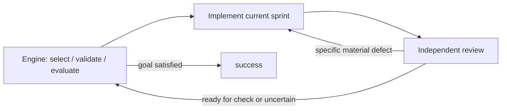

# Canonical loop workflow

This example runs the shipped [sprint-execute workflow](../../../internal/workflows/sprint-execute.yaml)
against a deliberately broken Go shipping-quote CLI. Real agents implement
two sprints, independent reviewers operate the CLI, and the engine runs the
acceptance commands and evidence judges before closing the ledger.

The starting CLI charges shipping incorrectly at exactly 50.00 and lacks
expedited shipping. The first sprint fixes standard shipping; the second adds
expedited shipping. The goal must remain unfinished after the first sprint,
and the final validation must recheck both modes.

## Run the workflow

From the Gimble checkout, create a disposable application repository and run
the actual workflow through a freshly built binary:

```sh
example_dir=$(mktemp -d)
cp -R examples/loops/canonical "$example_dir/workspace"
git -C "$example_dir/workspace" init -q
git -C "$example_dir/workspace" add .
git -C "$example_dir/workspace" -c user.name='Gimble example' -c user.email=gimble@example.invalid commit -qm 'Seed broken shipping CLI'
go build -o "$example_dir/gimble" ./cmd/gimble
"$example_dir/gimble" run sprint-execute --workdir "$example_dir/workspace" --logs "$example_dir/run"
```

Claude, Codex and agy must already be installed and authenticated. This spends
real model quota. Read the workflow with `gimble workflows show sprint-execute`.
The Go CLI can be operated directly with `go run ./cmd/quote 50.00 standard`
from the disposable workspace.



## Prove a new build with this workflow

The Go integration test prepares a fresh copy, builds Gimble, launches that
same `gimble run sprint-execute` command and inspects the real run. No model,
workflow step, CLI result or verdict is mocked. From a clean, committed checkout:

```sh
go test -tags=integration ./internal/workflows -run '^TestCanonicalLoop$' -count=1 -v -timeout=25m
```

For an existing candidate and a chosen new artifact directory outside the checkout:

```sh
go test -tags=integration ./internal/workflows -run '^TestCanonicalLoop$' -count=1 -v -timeout=25m -args -gimble-binary /absolute/path/to/gimble -proof-dir /absolute/new/proof-directory
```

The test requires Go build metadata naming this checkout's clean commit. It
retains the artifact directory, including `result.json`, baseline and final
CLI observations, the exported workflow, reviewer transcripts and repaired
repository. Missing harnesses, quota failures and the 20-minute workflow
deadline fail the test. The default Go test suite does not spend model quota;
this integration command is separately mandatory for build proof.

The acceptance scenarios in `quote_test.go` compile and invoke the real CLI at
49.99, 50.00 and 50.01 in each mode. Before the agents run, the integration test
compiles those scenarios into an executable outside their workspace. It uses
that unchanged executable to verify the final application independently.

The proof requires both reviewer returns, both item validations, revalidation
of standard shipping on the final lap, `not_done` followed by `done`, an
unchanged acceptance contract, and six successful final CLI invocations. It
also verifies that the source revision and candidate binary did not change.
For this proof process only, Codex memories are disabled, and reviewer tool
calls are checked for prior-memory reads. Inspect the actual transcripts too.

This is the flat checklist-loop baseline. Service lifecycle, nested loops and
failure/retry recovery need separate live scenarios. The initial negative
observations exercise the broken CLI before the workflow starts; they do not
claim an engine validation failed during the repair loop.
