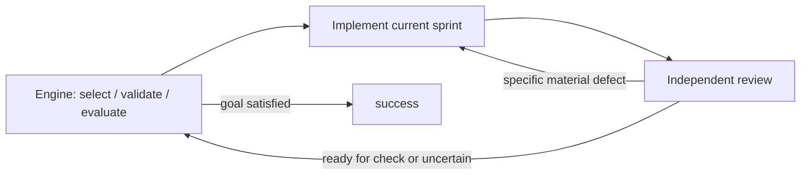

# Canonical loop build proof

This is the baseline example for Tractor's checklist loop. Every new build
claimed as proved must complete it with real native agents. Run from the
Tractor checkout:

```sh
python3 scripts/prove-build.py
```

The command builds Tractor, creates a disposable Git repository from this
fixture, and invokes **`tractor run sprint-execute` by name**. The workflow is
the [one embedded in the candidate binary](../../../internal/workflows/sprint-execute.yaml),
not a separately maintained demonstration graph. Claude, Codex and agy must
already be installed and authenticated. The run spends real model quota and
has a 20-minute deadline; a missing harness, timeout or failed proof exits
nonzero. It does not publish a release.

To prove a specific binary and retain artifacts at a chosen new path:

```sh
python3 scripts/prove-build.py --binary /absolute/path/to/tractor --output /absolute/new/proof-directory
```

## The example

The starting shipping-quote CLI incorrectly charges standard shipping at
exactly 50.00 and has no expedited mode. The two sprint documents specify
the complete, small application. Only `quote.py` needs changing.



The same loop carries both sprints. After the first passes, the goal evaluator
must still say `not_done`. On the second lap, the engine rechecks standard
shipping alongside expedited shipping before the goal can finish.

## Required evidence

`result.json` is written with `passed: false` before the run starts and becomes
true only after all of these observations:

- Public CLI invocations expose the seed's exact boundary bug and missing mode.
- Both sprint items are dispatched in order, implemented and independently
  reviewed, with each reviewer returning to engine validation.
- The final engine validation runs both item commands and their evidence
  judges successfully, including revalidation of the first completed item.
- The goal evaluator distinguishes partial work from completion, both ledger
  items close, and the pipeline completes.
- The acceptance files are unchanged and a fresh invocation of the original
  checker, outside the agents' workspace, confirms all six final CLI results.
- The binary and checkout inputs have the same hashes at start and finish.

The artifact directory contains the exact invocation, binary hash and Go build
metadata, source revision and input hash, exported embedded workflow, baseline
and final CLI output, complete run logs, reviewer transcripts, and the repaired
repository. Read the reviewer transcripts when assessing the proof: a passing
route alone cannot establish that the review was sound.

Do not reuse a receipt after changing the build or its inputs. Passing this
example is the minimum build proof, alongside ordinary checks and any proof
needed for changed behavior. It covers a flat checklist loop and a CLI; it does
not establish service lifecycle, nested loops, fan-out, steering, or recovery.
The initial negative observation is a real CLI failure before the run, not a
claim that an engine validation failed during the repair loop.
